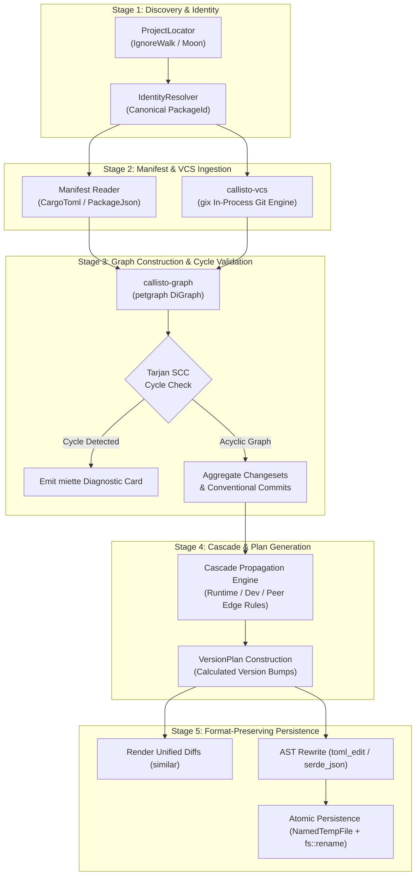
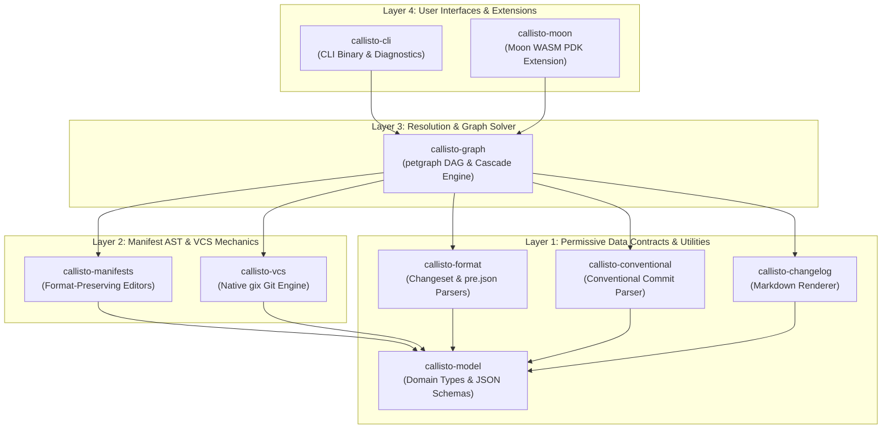
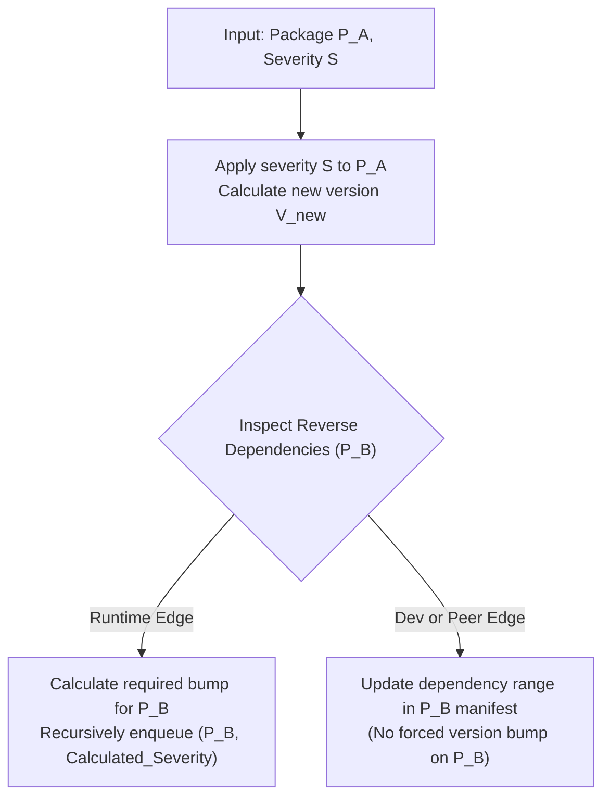
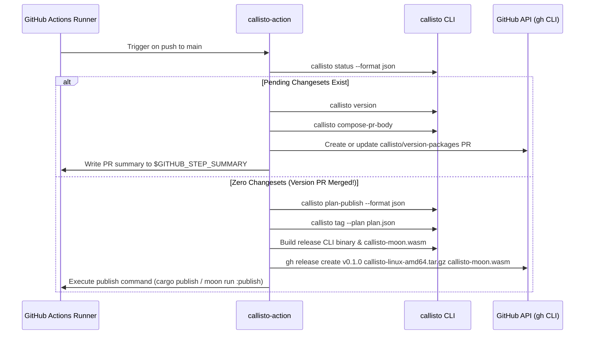

# Callisto Architecture & Engineering Specification

Callisto is a high-performance, polyglot monorepo versioning, changeset cascading, and release management engine written in Rust. It natively supports Cargo (`Cargo.toml`), Node.js/npm (`package.json`), Python (`pyproject.toml`), Go (`go.mod`), Deno (`deno.json`), and Moon (`moon`).

This document serves as the authoritative architectural specification for Callisto, covering crate boundaries, domain models, graph algorithms, file mutation guarantees, trait seams, and GitHub Actions orchestration.

---

## 1. Executive Architecture & Strategic Invariants

Callisto addresses key architectural deficiencies in existing release management tools:
- **Runtime Performance**: Replaces heavy JavaScript/Node.js runtimes (`@changesets/cli`) with an optimized native Rust engine that completes status, versioning, and graph operations in `<10ms`.
- **AST Format Preservation**: Replaces destructive text/regex search-and-replace with concrete syntax tree (CST) editors (`toml_edit` and `serde_json` with indentation fingerprinting), preserving comments, table order, and whitespace.
- **Crash-Safe File Mutations**: Enforces atomic filesystem transactions using temporary directory file swaps (`NamedTempFile` + `fs::rename`) to prevent half-written or corrupt manifests during unexpected process termination.
- **In-Process Git Engine**: Eliminates external `git` subprocess spawns by leveraging `gix` (gitoxide) for fast, thread-safe repository discovery, commit traversal, and ref resolution.
- **Formal Graph Solver**: Constructs a directed acyclic graph (DAG) using `petgraph`, executing Tarjan's Strongly Connected Components (SCC) algorithm to detect circular dependencies before applying topological version cascades.
- **Dual Licensing Isolation**: Separates permissive data types (`MIT/Apache-2.0`) from copyleft execution logic (`AGPL-3.0`), allowing third-party tools to consume Callisto's domain contracts without importing AGPL code.

---

## 2. System Architecture & Pipeline Data Flow

Callisto processes monorepo release workflows through a deterministic 5-stage pipeline:



---

## 3. Workspace Crate Topography & Layer Isolation

Callisto is structured into 10 workspace crates organized across 4 strict layer boundaries to enforce acyclic dependencies:



### Layer Rules & Licensing Matrix

| Crate | License | Layer | Responsibility | Key Dependencies |
| :--- | :--- | :--- | :--- | :--- |
| `callisto-model` | MIT/Apache-2.0 | Layer 1 | Core domain primitives, version grammars, JSON report schemas | `semver`, `schemars`, `serde` |
| `callisto-format` | MIT/Apache-2.0 | Layer 1 | Byte-compatible parser and writer for changeset `.md` and `pre.json` | `indexmap`, `serde` |
| `callisto-conventional` | AGPL-3.0 | Layer 1 | Conventional commit parsing and severity classification | `conventional_commits_next` |
| `callisto-changelog` | AGPL-3.0 | Layer 1 | Sectioned Markdown changelog rendering | `pulldown-cmark` |
| `callisto-manifests` | AGPL-3.0 | Layer 2 | Format-preserving manifest AST editing and atomic writes | `toml_edit`, `serde_json`, `tempfile` |
| `callisto-vcs` | AGPL-3.0 | Layer 2 | Native in-process Git discovery, commit walks, and tag listing | `gix` (gitoxide, target-gated for wasm32) |
| `callisto-graph` | AGPL-3.0 | Layer 3 | Dependency DAG construction, Tarjan SCC cycle detection, cascade engine | `petgraph`, `ignore` |
| `callisto-cli` | AGPL-3.0 | Layer 4 | Standalone CLI binary, colored diff previews, `miette` error reporting | `clap`, `miette`, `anstream`, `similar` |
| `callisto-moon` | AGPL-3.0 | Layer 4 | Moon extension host integration and WASM compilation target | `extism-pdk` (`wasm32-wasip1`) |
| `callisto-fixtures` | AGPL-3.0 | Dev | Multi-ecosystem corpus and in-memory test doubles | Dev-only test helpers |

---

## 4. Formal Domain Model & Type System

Callisto defines type-safe primitives in `callisto-model` to prevent stringly-typed bugs across ecosystem boundaries:

### Core Domain Primitives

- `PackageId(String)`: Unique canonical identity for a workspace package (e.g. `callisto-cli` or `@myorg/web-app`).
- `Version`: SemVer version wrapper (`semver::Version`) enforcing SemVer 2.0.0 specification rules.
- `Severity`: Bumping magnitude enum (`None < Patch < Minor < Major`). Implements `Ord` to allow computing maximum required severity across multiple changesets.
- `Changeset`: Representation of a `.changeset/<id>.md` document:
  ```rust
  pub struct Changeset {
      pub id: String,
      pub releases: IndexMap<PackageId, Severity>,
      pub summary: String,
  }
  ```
- `PreState`: Model for `.changeset/pre.json` managing pre-release modes (e.g. `alpha`, `beta`, `rc`):
  ```rust
  pub struct PreState {
      pub mode: PreMode, // Enter | Exit
      pub tag: String,
      pub initial_versions: IndexMap<PackageId, Version>,
      pub changesets: Vec<String>,
  }
  ```

---

## 5. Manifest Parsing & Atomic Mutation Mechanics

Callisto guarantees that editing package manifests (`Cargo.toml`, `package.json`) never corrupts file formatting or damages unmanaged sections.

### Concrete Syntax Tree (CST) Editing for `Cargo.toml`

`callisto-manifests` uses `toml_edit` to parse `Cargo.toml` into a Concrete Syntax Tree. This ensures:
- Header comments, inline comments, and section spacing are preserved exactly.
- Key ordering within tables remains untouched.
- Version string updates target only the specific `[package].version` item or path dependency tables (`[dependencies.crate-name].version`).

### Indentation Fingerprinting for `package.json`

JSON specifications do not preserve formatting. `callisto-manifests` addresses this by fingerprinting `package.json` before parsing:
1. Scans line prefixes to determine indentation style (`IndentStyle::Tabs` vs `IndentStyle::Spaces(usize)`).
2. Parses the document using `serde_json` with `preserve_order` enabled to preserve key insertion order.
3. Serializes updated documents using a custom formatter matching the fingerprinted indentation style and line endings (`LF` vs `CRLF`).

### Atomic Disk Persistence (`atomic_write`)

To guarantee crash-safety during file writes:

```rust
pub fn atomic_write(target_path: &Path, content: &[u8]) -> Result<(), ManifestError> {
    let parent_dir = target_path.parent().ok_or(...)?;
    let mut temp_file = NamedTempFile::new_in(parent_dir)?;
    temp_file.write_all(content)?;
    temp_file.flush()?;
    temp_file.persist(target_path)?;
    Ok(())
}
```

By creating `NamedTempFile` in the same directory as the target file, Callisto ensures the final `fs::rename` step is an atomic OS kernel operation on POSIX and Windows filesystems.

---

## 6. Dependency DAG Engine & Algorithmic Complexities

Workspace package relationships form a directed graph `G = (V, E)` where vertices $V$ represent `PackageId` nodes and edges $E$ represent dependency declarations.

### Topological Sorting & Cycle Diagnostics

1. **Graph Construction**: `callisto-graph` builds a `petgraph::graph::DiGraph<PackageId, DepEdge>`.
2. **Cycle Detection (Tarjan's SCC Algorithm)**:
   - Before calculating version bumps, `callisto-graph` executes Tarjan's Strongly Connected Components algorithm ($O(|V| + |E|)$ time, $O(|V|)$ space).
   - If circular dependencies exist (e.g. $A \to B \to C \to A$), Callisto isolates the exact cycle path and formats a colorized `miette` diagnostic card:

   ```text
   Error: Circular dependency cycle detected in workspace graph
     callisto-graph → callisto-manifests → callisto-graph
   Tip: Refactor shared types into a common Layer 1 crate or mark peer dependencies.
   ```

3. **Topological Order Execution**:
   - Executes Kahn's algorithm ($O(|V| + |E|)$) to establish linear build and publish ordering.

### Bump Cascade Engine

When a package $P_A$ is bumped from version $V_{old}$ to $V_{new}$ with severity $S$:



### Version Groups (Fixed & Linked)

`callisto.toml` supports version group rules:
- **`[[fixed-group]]`**: All packages in the group are forced to bump in lock-step to the maximum version calculated across any member in the group.
- **`[[linked-group]]`**: Packages in the group share severity bumps, but maintain independent base version offsets.

---

## 7. In-Process VCS Engine (`callisto-vcs`)

`callisto-vcs` integrates `gix` (gitoxide) for in-process Git operations, avoiding the performance overhead and flakiness of invoking `git` CLI subprocesses.

### Key VCS Capabilities

- **Repository Discovery**: Walks parent directories from the current working directory to locate `.git`.
- **Commit Walks**: Performs in-process commit history traversals to evaluate conventional commits since a given Git ref or release tag.
- **Tag Listing**: Matches tags against glob patterns (`v*`, `@scope/*`) using `globset`.

### Target-Gated WASM Compatibility Architecture

`gix` relies on POSIX signal handlers (`gix-tempfile` -> `signal-hook-registry`), which are unsupported when compiling to WebAssembly (`wasm32-wasip1`). `callisto-vcs` uses conditional compilation target-gating:

```rust
// Native CLI target (macOS, Linux, Windows)
#[cfg(not(target_arch = "wasm32"))]
pub struct GitRepository {
    repo: gix::Repository,
}

// WASM extension target (wasm32-wasip1 for Moon)
#[cfg(target_arch = "wasm32")]
pub struct GitRepository;
```

On WASM targets, native Git operations cleanly return non-fatal fallback errors while project discovery and graph operations execute at full speed.

---

## 8. Extension Architecture & Trait Seams

Callisto decouples core algorithms from platform-specific I/O using four core trait seams:

```rust
// 1. Locate workspace project roots
pub trait ProjectLocator {
    fn projects(&self) -> Result<Vec<ProjectRoot>, LocateError>;
}

// 2. Supply graph node and edge metadata
pub trait DependencyResolver {
    fn packages(&self) -> impl Iterator<Item = &Package>;
    fn dependencies_of(&self, id: &PackageId) -> impl Iterator<Item = &DepEdge>;
}

// 3. Command execution abstraction
pub trait CommandRunner: Send + Sync {
    fn exec(&self, cmd: &str, args: &[&str], cwd: &Path) -> Result<CommandOutput, CommandError>;
}

// 4. Per-ecosystem manifest reader/writer
pub trait Manifest {
    fn current_version(&self) -> Result<Version, ManifestError>;
    fn write_version(&mut self, new_version: &Version) -> Result<(), ManifestError>;
    fn write_dependency(&mut self, name: &str, new_spec: DepSpec) -> Result<(), ManifestError>;
}
```

### Moon WASM Plugin Binding (`callisto-moon`)

`callisto-moon` compiles Callisto into a `wasm32-wasip1` plugin using `extism-pdk`. Moon loads `callisto-moon.wasm` inside Extism, passing host environment queries through Extism FFI exports (`#[plugin_fn]`).

---

## 9. GitHub Actions Orchestration (`callisto-action`)

Callisto includes a built-in composite action ([`.github/actions/callisto-action/action.yml`](.github/actions/callisto-action/action.yml)) for CI/CD automation:



---

## 10. Engineering Invariants & Quality Controls

All contributions to Callisto must adhere to the following 4 engineering invariants:

1. **Safe Rust Strictness**: `unsafe_code = "forbid"` is enforced across all 10 workspace crates.
2. **Zero Clippy Warnings**: Code must compile with zero warnings under `cargo clippy --all-targets -- -D warnings`.
3. **Format Enforcement**: Code formatting must strictly match `cargo fmt --check`.
4. **Comprehensive Test Suite Coverage**: Unit, integration, doctests, and lifecycle E2E tests must pass (`just ci`).

---

## 11. Interactive Terminal UI Engine & Task Standardization

### 5-Step Interactive Terminal Wizard

`callisto add` implements a 5-step terminal UI wizard powered by `dialoguer` when executed interactively:

1. **Package Selection (`MultiSelect`)**: Selects target packages across the workspace.
2. **Major Bump Selection (`MultiSelect`)**: Identifies packages requiring a breaking major version bump.
3. **Minor Bump Selection (`MultiSelect`)**: Identifies packages requiring minor version bumps (defaulting others to patch).
4. **Summary Entry (`Input`)**: Solicits human summary description text.
5. **Confirmation Preview (`Confirm`)**: Renders colored frontmatter diff preview and requests confirmation before writing `.changeset/<human-slug>.md`.

When executed non-interactively via flags (`--package pkg:severity`), `callisto add` bypasses the terminal wizard for instant, sub-10ms agent execution.

### Canonical Task Runner Standardization

Callisto standardizes all task execution on `just` wrapping `moon`:
- `just ci`: Canonical verification pipeline (Formatting, Clippy, Moon unit/integration tests, `cargo-deny` audit, WASM check).
- `just test`: Standard workspace test execution (`moon run :test`).
- `just audit`: Standard security advisory check (`moon run :audit`).

