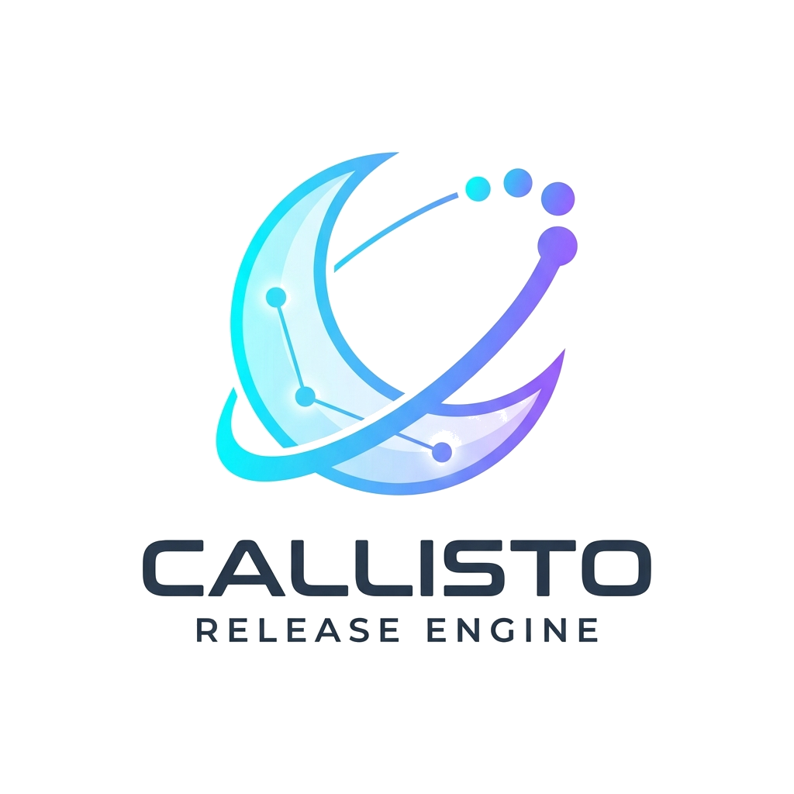
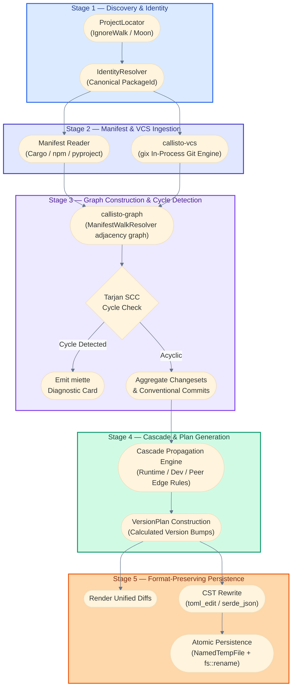
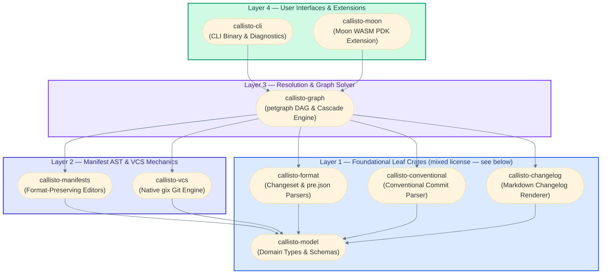
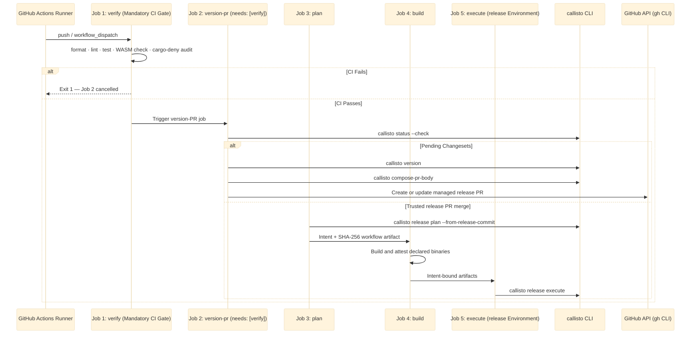

<p align="center">
  
</p>

<h1 align="center">Callisto Architecture & Engineering Specification</h1>

<p align="center">
  <b>Authoritative specification for crate topography, graph algorithms, format preservation, and CI orchestration.</b>
</p>

---

## 1. Executive Architecture & Strategic Invariants

Callisto addresses key architectural deficiencies in existing release management tools:
- **Runtime Performance**: Replaces heavy JavaScript/Node.js runtimes (`@changesets/cli`) with an optimized native Rust engine that completes status, versioning, and graph operations in `<10ms`.
- **AST Format Preservation**: Replaces destructive text/regex search-and-replace with concrete syntax tree (CST) editors (`toml_edit` and `serde_json` with indentation fingerprinting), preserving comments, table order, and whitespace.
- **Crash-Safe File Mutations**: Enforces atomic filesystem transactions using temporary directory file swaps (`NamedTempFile` + `fs::rename`) to prevent half-written or corrupt manifests during unexpected process termination.
- **In-Process Git Engine**: Eliminates external `git` subprocess spawns by leveraging `gix` (gitoxide) for fast, thread-safe repository discovery, commit traversal, and ref resolution.
- **Formal Graph Solver**: Constructs the workspace dependency graph as a hand-rolled adjacency structure (`ManifestWalkResolver`), then runs `petgraph`'s Tarjan Strongly Connected Components (SCC) algorithm over a transient graph built specifically for cycle-path extraction, to detect circular dependencies before applying topological version cascades.
- **Dual Licensing Isolation**: Separates permissive data types (`MIT/Apache-2.0`) from copyleft execution logic (`AGPL-3.0`), allowing third-party tools to consume Callisto's domain contracts without importing AGPL code.

---

## 2. System Architecture & Pipeline Data Flow

Callisto processes monorepo release workflows through a deterministic 5-stage pipeline:



---

## 3. Workspace Crate Topography & Layer Isolation

Callisto is structured into 10 workspace crates organized across 4 strict layer boundaries to enforce acyclic dependencies:



### Layer Rules & Licensing Matrix

| Crate | License | Layer | Responsibility | Key Dependencies |
| :--- | :--- | :--- | :--- | :--- |
| `callisto-model` | MIT/Apache-2.0 | Layer 1 | Core domain primitives, version grammars, JSON report schemas, atomic disk writes | `semver`, `schemars`, `serde`, `tempfile` |
| `callisto-format` | MIT/Apache-2.0 | Layer 1 | Byte-compatible parser and writer for changeset `.md` and `pre.json` | `indexmap`, `serde` |
| `callisto-conventional` | AGPL-3.0 | Layer 1 | Conventional commit parsing and severity classification | `thiserror` |
| `callisto-changelog` | AGPL-3.0 | Layer 1 | Sectioned Markdown changelog rendering | `callisto-model`, `thiserror`, `miette` |
| `callisto-manifests` | AGPL-3.0 | Layer 2 | Format-preserving manifest AST editing (atomic writes live in `callisto-model`, §5) | `toml_edit`, `serde_json`, `indexmap` |
| `callisto-vcs` | MIT/Apache-2.0 | Layer 2 | Git operations via `gix` (native, non-wasm32) with `ShellGit` fallback | `gix`, `globset` |
| `callisto-graph` | AGPL-3.0 | Layer 3 | Dependency DAG construction, Tarjan SCC cycle detection, cascade engine | `petgraph`, `ignore` |
| `callisto-cli` | AGPL-3.0 | Layer 4 | Standalone CLI binary, colored diff previews, `miette` error reporting | `clap`, `miette`, `anstream`, `similar` |
| `callisto-moon` | AGPL-3.0 | Layer 4 | Moon extension host integration and WASM compilation target | `extism-pdk` (`wasm32-wasip1`) |
| `callisto-fixtures` | AGPL-3.0 | Dev | Multi-ecosystem corpus and in-memory test doubles | Dev-only test helpers |

**"Layer 1" is a dependency-depth tier here, not a license tier.** The diagram above groups
`callisto-model`, `callisto-format`, `callisto-conventional`, and `callisto-changelog` into one
"Layer 1" box because all four are leaf crates whose only internal dependency is
`callisto-model` itself — but only the first two are actually permissively licensed. The
project's enforced licensing invariant (`CLAUDE.md`) is narrower and does not use this
diagram's layer numbers: **only `callisto-model` and `callisto-format` are required to stay
MIT/Apache-2.0 and never depend on an AGPL crate.** `callisto-conventional` and
`callisto-changelog` are AGPL-3.0 leaf crates that happen to sit at the same dependency depth,
not members of that protected set — the table's own License column is the authoritative source
for any given crate's actual license, not this section's diagram grouping.

---

## 4. Formal Domain Model & Type System

Callisto defines type-safe primitives in `callisto-model` to prevent stringly-typed bugs across ecosystem boundaries:

### Core Domain Primitives

- `PackageId(String)`: Unique canonical identity for a workspace package (e.g. `callisto-cli` or `@myorg/web-app`).
- `Version`: SemVer version wrapper (`semver::Version`) enforcing SemVer 2.0.0 specification rules.
- `Severity`: Bumping magnitude enum (`None < Patch < Minor < Major`). Implements `Ord` to allow computing maximum required severity across multiple changesets.
- `Changeset`: Representation of a `.changeset/<id>.md` document:
  ```rust
  pub struct Changeset {
      pub id: String,
      pub releases: IndexMap<PackageId, Severity>,
      pub summary: String,
  }
  ```
- `PreState`: Model for `.changeset/pre.json` managing pre-release modes (e.g. `alpha`, `beta`, `rc`):
  ```rust
  pub struct PreState {
      pub mode: PreMode, // Enter | Exit
      pub tag: String,
      pub initial_versions: IndexMap<PackageId, Version>,
      pub changesets: Vec<String>,
  }
  ```

---

## 5. Manifest Parsing & Atomic Mutation Mechanics

Callisto guarantees that editing package manifests (`Cargo.toml`, `package.json`) never corrupts file formatting or damages unmanaged sections.

### Concrete Syntax Tree (CST) Editing for `Cargo.toml`

`callisto-manifests` uses `toml_edit` to parse `Cargo.toml` into a Concrete Syntax Tree. This ensures:
- Header comments, inline comments, and section spacing are preserved exactly.
- Key ordering within tables remains untouched.
- Version string updates target only the specific `[package].version` item or path dependency tables (`[dependencies.crate-name].version`).

### Indentation Fingerprinting for `package.json`

JSON specifications do not preserve formatting. `callisto-manifests` addresses this by fingerprinting `package.json` before parsing:
1. Scans line prefixes to determine indentation style (`IndentStyle::Tabs` vs `IndentStyle::Spaces(usize)`).
2. Parses the document using `serde_json` with `preserve_order` enabled to preserve key insertion order.
3. Serializes updated documents using a custom formatter matching the fingerprinted indentation style and line endings (`LF` vs `CRLF`).

### Atomic Disk Persistence (`atomic_write`)

To guarantee crash-safety during file writes:

```rust
pub fn atomic_write(path: &Path, content: &str, permit: &ApplyPermit) -> io::Result<()> {
    let parent_dir = path.parent().ok_or(...)?;
    let mut temp_file = NamedTempFile::new_in(parent_dir)?;
    temp_file.write_all(content.as_bytes())?;
    temp_file.as_file().sync_all()?;
    temp_file.persist(path)?;
    // fsync parent and grandparent directories for durability after rename.
    sync_dir(parent_dir)?;
    if let Some(grandparent) = parent_dir.parent() { sync_dir(grandparent)?; }
    Ok(())
}
```

`ApplyPermit` is a capability token that must be obtained before any mutating operation (see §7). By creating `NamedTempFile` in the same directory as the target file, the final `fs::rename` is an atomic OS kernel operation on POSIX and Windows filesystems. Parent and grandparent directory fsyncs ensure the rename is durable on power-loss.

---

## 6. Dependency DAG Engine & Algorithmic Complexities

Workspace package relationships form a directed graph `G = (V, E)` where vertices $V$ represent `PackageId` nodes and edges $E$ represent dependency declarations.

### Topological Sorting & Cycle Diagnostics

1. **Graph Construction**: `callisto-graph` builds `ManifestWalkResolver` — a hand-rolled adjacency structure (`Vec<DepEdge>` plus `BTreeMap<PackageId, Vec<usize>>` in/out indexes), not a `petgraph` type. `petgraph` is used narrowly for step 2 below: a transient `DiGraph<PackageId, ()>` built specifically to feed Tarjan SCC.
2. **Cycle Detection (Tarjan's SCC Algorithm)**:
   - Before calculating version bumps, `callisto-graph` executes `petgraph::algo::tarjan_scc` over that transient graph ($O(|V| + |E|)$ time, $O(|V|)$ space).
   - If circular dependencies exist (e.g. $A \to B \to C \to A$), Callisto isolates the exact cycle path and formats a colorized `miette` diagnostic card:

   ```text
   Error: Circular dependency cycle detected in workspace graph
     callisto-graph → callisto-manifests → callisto-graph
   Tip: Refactor shared types into a common Layer 1 crate or mark peer dependencies.
   ```

3. **Topological Order Execution**:
   - Executes Kahn's algorithm ($O(|V| + |E|)$) to establish linear build and publish ordering.

### Bump Cascade Engine

When a package $P_A$ is bumped from version $V_{old}$ to $V_{new}$ with severity $S$:


### Version Groups (Fixed & Linked)

`callisto.toml` supports version group rules:
- **`[[fixed-group]]`**: All packages in the group are forced to bump in lock-step to the maximum version calculated across any member in the group.
- **`[[linked-group]]`**: Packages in the group share severity bumps, but maintain independent base version offsets.

---

## 7. In-Process VCS Engine (`callisto-vcs`)

`callisto-vcs` provides Git operations through a dual-backend design: a native `gix` (gitoxide) backend for non-WASM targets, and a `ShellGit` backend that shells out to the real `git` binary for portability and WASM fallback.

### Key VCS Capabilities

- **Repository Discovery**: Walks parent directories from the current working directory to locate `.git` (native backend only; shell backend uses `git rev-parse --show-toplevel`).
- **Commit Walks**: Retrieves commit history to evaluate conventional commits since a given Git ref or release tag.
- **Tag Listing**: Matches tags against glob patterns (`v*`, `@scope/*`) using `globset` (both backends apply identical `globset` matching semantics).

### Dual-Backend Architecture (`GitAccess`)

`callisto-vcs` exposes a unified `GitDataSource` trait. The `GitAccess` selector implements it with a deliberate fallback policy:

- **Read operations** (`list_tags`, `resolve_commit`, `commits_since`): attempt the native `gix` backend first; fall back to `ShellGit` on any error, including failed repo discovery.
- **Write operations** (`create_tag`, `create_floating_major`): fall back to `ShellGit` only when native `gix` was unavailable from the start. A discovered repo's result is authoritative — a second backend retry could mask partial mutations.

```rust
pub struct GitAccess<'r> {
    native: Option<GitRepository>,  // None on wasm32 or outside a repo
    shell: ShellGit<'r>,            // always available via CommandRunner
}
```

### WASM Target Constraints

`gix` depends on POSIX signal handlers (`gix-tempfile` -> `signal-hook-registry`), which are unsupported on `wasm32-wasip1`. `GitRepository::discover` always returns `Err` on that target (via a compile-time feature gate), so `GitAccess` automatically routes all operations through `ShellGit`, which calls `git` via the Extism host bridge.

Note: a 2026 probe confirmed that `gix` object reads fail with `ENOSYS` on WASM even with the signal-hook dependency removed. The shell-git fallback is therefore the production code path for the Moon WASM plugin.

---

## 8. Extension Architecture & Trait Seams

Callisto decouples core algorithms from platform-specific I/O using four core trait seams:

```rust
// 1. Locate workspace project roots
pub trait ProjectLocator: Send + Sync {
    fn projects(&self) -> Result<Vec<ProjectRoot>, LocateError>;
    // Non-authoritative cross-check only (moon's declared project-graph edges);
    // default impl returns None. Overridden by MoonProjectLocator.
    fn declared_edges(&self) -> Option<Vec<DeclaredEdge>> {
        None
    }
}

// 2. Command execution abstraction
pub trait CommandRunner: Send + Sync {
    fn run(&self, program: &str, args: &[&str], cwd: &Path) -> Result<CommandOutput, CommandError>;

    // Default: delegates to run(). CliCommandRunner overrides with real
    // spawn + poll + kill so that hung publish commands do not block forever.
    fn run_with_timeout(&self, program: &str, args: &[&str], cwd: &Path, timeout: Duration)
        -> Result<CommandOutput, CommandError>;
}

// 3. Per-ecosystem manifest reader/writer
pub trait Manifest: Send + Sync {
    fn path(&self) -> &Path;
    fn ecosystem(&self) -> Ecosystem;
    fn role(&self) -> ManifestRole;
    fn package_name(&self) -> Result<String, ManifestError>;
    fn current_version(&self) -> Result<Version, ManifestError>;
    // Mutating methods only touch the in-memory CST; nothing reaches disk
    // until persist() is called explicitly (write-batching lets a caller
    // apply several mutations to one open manifest before one disk write).
    fn write_version(&mut self, v: &Version, permit: &ApplyPermit) -> Result<(), ManifestError>;
    fn persist(&mut self, permit: &ApplyPermit) -> Result<(), ManifestError>;
    fn iter_dependencies(&self) -> Box<dyn Iterator<Item = DependencyEntry> + '_>;
    fn update_dependency_spec(&mut self, name: &str, kind: DepKind, new: DepSpec, permit: &ApplyPermit)
        -> Result<(), ManifestError>;
    // Batched: applies every (name, version) pair against one open manifest handle.
    fn update_optional_dependencies(&mut self, updates: &[(String, Version)], permit: &ApplyPermit)
        -> Result<(), ManifestError>;
    // is_publishable() and publish_targets() are also required; omitted for brevity.
}

// 4. DependencyResolver supplies graph nodes and edges
pub trait DependencyResolver: Send + Sync {
    fn packages(&self) -> impl Iterator<Item = &Package>;
    fn dependencies_of(&self, id: &PackageId) -> impl Iterator<Item = &DepEdge>;
    fn dependents_of(&self, id: &PackageId) -> impl Iterator<Item = &DepEdge>;
    // diagnostics() has a default impl returning an empty slice.
}
```

### Moon WASM Plugin Binding (`callisto-moon`)

`callisto-moon` compiles Callisto into a `wasm32-wasip1` plugin using `extism-pdk`. Moon loads `callisto-moon.wasm` inside Extism, passing host environment queries through Extism FFI exports (`#[plugin_fn]`).

---

## 9. GitHub Actions Orchestration (`callisto-action`)

Callisto includes a built-in composite action ([`.github/actions/callisto-action/action.yml`](.github/actions/callisto-action/action.yml)) that creates or updates a reviewed version PR. The repository release workflow owns the post-merge plan, build, attestation, and protected execute stages; see [`docs/06-publishing.md`](docs/06-publishing.md).



### Complete Action Input Matrix

| Input | Default | Purpose |
| :--- | :--- | :--- |
| `version_command` | `"callisto version"` | Custom versioning command. Append `--refresh-lockfiles` if your workspace has interdependent Cargo/Python packages -- see below. |
| `commit_message` | `"chore(release): version packages"` | Commit message for the Version Packages PR. |
| `title` | `"chore(release): version packages"` | Pull Request title. |
| `pr_label` | `"callisto: release"` | Label automatically attached to the Version Packages PR. |
| `setup_git_user` | `"true"` | Kept for backward compatibility; now a documented no-op. The action updates the release branch through the forge commit API, not a local Git commit, so there is no local Git identity left to configure. |
| `branch` | `"main"` | Base branch for Version PRs. |
| `release_branch` | `"callisto/version-packages"` | Managed head branch for the Version PR. |
| `github_token` | `""` | Optional token for GitHub PR and commit-API operations. The built-in token remains the default and is sufficient, since the action never needs `.github/workflows/*` write permission. |
| `setup_callisto` | `"true"` | Install the Callisto environment before versioning. |
| `cwd` | `"."` | Working directory path if workspace root is nested in a subfolder. |

### Lockfile Staleness (`--refresh-lockfiles`)

`callisto version` bumps manifest versions (`Cargo.toml`, `package.json`, `pyproject.toml`) but
does not regenerate lockfiles by default. The release executor publishes Cargo packages
with `cargo publish --locked`, which fails if `Cargo.lock` is stale relative to the bumped `Cargo.toml` versions --
this can happen when bumping an interdependent Cargo package changes what a workspace member's
own `Cargo.lock` entry should say.

`callisto version --refresh-lockfiles` closes this gap for Cargo and Python: it runs `cargo
update --workspace` (Cargo) and, if present, `uv lock` or `poetry lock --no-update` (Python)
after bumping, before staging changes for commit (`crates/callisto-graph/src/apply.rs`). It is
opt-in (default `false`) since most workspaces don't need it -- override the action's
`version_command` input to `"callisto version --refresh-lockfiles"` if your workspace has
interdependent Cargo or Python packages whose versions are bumped together.

npm-family lockfiles (`package-lock.json`, `pnpm-lock.yaml`, `yarn.lock`, `bun.lockb`) are not
refreshed by `--refresh-lockfiles`: unlike `cargo publish --locked`, neither `npm publish` nor
`pnpm publish` (`crates/callisto-graph/src/commands/publish_client.rs`) pass any lockfile-
strictness flag, so a stale npm-family lockfile does not fail publish the way a stale
`Cargo.lock` does. This has not been a reported problem for npm/pnpm; if that changes, add the
equivalent `npm install --package-lock-only` / `pnpm install --lockfile-only` step to
`--refresh-lockfiles`'s existing Cargo/PyPI implementation rather than a separate workaround in
the Action.

### Coverage threshold

`just coverage [threshold]` is the one command both `callisto-ci.yml` and a local developer run --
CI calls `just coverage 90` (`callisto-ci.yml`'s `coverage` job, a required check in `validate`'s
`needs` list), so a coverage-gate failure always reproduces locally with that exact invocation, no
raw `cargo llvm-cov` flags improvised separately in the workflow YAML. With `threshold` omitted
(`just coverage`), the run is unthresholded/informational -- `--ignore-filename-regex '_pdk\.rs$'`
is always applied regardless (see the naming convention note below) -- and not part of `just
ci`/`just ci-fast` -- coverage generation is a CI-only gate, run on demand locally. A PR that
regresses total line coverage below 90% fails CI, not just informationally. The
baseline at the time this gate was added was 90.40%, leaving a thin ~0.4-point margin -- a
deliberate choice to catch essentially any regression, at the cost of the gate being more sensitive
to normal coverage fluctuation than a wider margin would be. This is also the only place the
workspace compiles and tests under `--all-features` together (`just test`/`just wasm-check` cover
default features plus `callisto-moon`'s `pdk` feature separately, never combined).

`_pdk.rs`-suffixed files (e.g. `crates/callisto-moon/src/runner_pdk.rs`,
`crates/callisto-moon/src/extension_pdk.rs`) are excluded from every coverage command via that
naming convention: they contain code that only executes inside a real wasm32-wasip1 Extism host
(black-box tested via `tests/moon_wasm_sandbox.rs`), invisible to native `cargo-llvm-cov`
instrumentation by construction, not a real testing gap. `#[coverage(off)]`, the closer Rust-native
equivalent, remains nightly-only unstable (confirmed against stable `rustc`, and against the still-
open tracking issue rust-lang/rust#84605) -- worth revisiting if this crate ever adopts a nightly
toolchain for coverage specifically, but file-level exclusion is what works on stable today.

The workspace-total gate can pass while a single small crate is far below threshold -- a few
large crates (`callisto-graph` alone is ~15,000 of the workspace's ~26,000 covered lines) dominate
the total, so a badly-undertested small crate barely moves it. `just coverage-per-crate [threshold]`
(default 90) reuses the same profile data to compute and gate on each crate's own line coverage
independently; `coverage`'s CI job runs it non-blocking (a `::warning::` annotation, not a failed
check) until the pre-existing per-crate gaps are closed, at which point it should be promoted to a
required check. `callisto-moon` was the worst offender (70.89%) before the `_pdk.rs` split above;
its true native-testable coverage is 92.0%, already above the 90% bar.

### Diagnostic Problem Matchers & Toolchain Isolation

- **Inline PR Annotations**: Registered [`.github/callisto-problem-matcher.json`](.github/callisto-problem-matcher.json) in `setup-callisto`. Automatically highlights invalid `.changeset/*.md` syntax or missing package IDs as inline callouts on PR diff lines.
- **Pre-installed Toolchain Targets**: All toolchain setup steps declare `targets: wasm32-wasip1` up-front alongside `rustfmt` and `clippy`. This prevents parallel `rustup` download race conditions when Moon executes 10 crate tasks in parallel.
- **Unbuffered Stream Output & UI Accordions**: Long-running shell commands use `::group::` and `::endgroup::` annotations for foldable UI accordions, streaming stdout and stderr live to the runner console.

---

## 10. PR Pre-Flight Verification & Local Git Hooks

### PR Pre-Flight Verification (`callisto-validate`)

Every Pull Request runs the standalone [`.github/actions/callisto-validate/action.yml`](.github/actions/callisto-validate/action.yml) action:
1. **Package Discovery Guard**: Verifies all workspace crates and packages are accounted for in `callisto.toml`.
2. **Schema & Config Health**: Validates `callisto.toml` fields and types.
3. **Changeset Syntax Integrity**: Verifies `.changeset/*.md` frontmatter and package IDs.
4. **Pre-Flight Release Simulation**: Simulates `callisto plan-publish` topological DAG sorting to ensure zero cyclic dependencies before PR merge.

### Ultra-Fast Local Git Hooks (`pre-commit` & `pre-push`)

Callisto standardizes local developer hook workflows in [`justfile`](justfile):
- `just pre-commit` (~100ms): Fast formatting check before local commits.
- `just pre-push` (~1.5s): Formatting check and Clippy lints before remote pushes.
- `just hooks`: Installs native `.git/hooks/pre-commit` and `.git/hooks/pre-push` shell scripts in one command.

---

## 11. Engineering Invariants & Quality Controls

All contributions to Callisto must adhere to the following 4 engineering invariants:

1. **Safe Rust Strictness**: `unsafe_code = "forbid"` is enforced across all 10 workspace crates.
2. **Zero Clippy Warnings**: Code must compile with zero warnings under `cargo clippy --all-targets -- -D warnings`.
3. **Format Enforcement**: Code formatting must strictly match `cargo fmt --check`.
4. **Comprehensive Test Suite Coverage**: Unit, integration, doctests, and lifecycle E2E tests must pass (`just ci`).

---

## 12. Zero-Config Multi-Platform Native Matrix Auto-Discovery (`callisto matrix`) [partially implemented]

> **Status: napi-rs and maturin platform-target discovery, plus npm/PyPI runtime-version constraints, are implemented** (`callisto matrix [--package <name>]`, `--format text|json` via the global flag). Java (JNI) target discovery, .NET native-AOT target discovery, and the `callisto publish-target` subcommand described later in this section remain unimplemented and are planned for a future release.

To eliminate configuration duplication and configuration drift across native Rust, NAPI-RS, Maturin (Python), and Java (JNI) polyglot monorepos, `callisto matrix` provides dynamic matrix auto-discovery:

```text
┌────────────────────────────────────────────────────────────────────────┐
│               CALLISTO NATIVE MATRIX AUTO-DISCOVERY                     │
├────────────────────────────────────────────────────────────────────────┤
│ Workspace Manifests (Cargo.toml, package.json, pyproject.toml)        │
│ ↳ Single Source of Truth: napi.targets, maturin.targets, engines.node  │
├────────────────────────────────────────────────────────────────────────┤
│ callisto matrix --format json                                          │
│ ↳ Dynamically computes runner OS, target triples, & runtime versions   │
├────────────────────────────────────────────────────────────────────────┤
│ GitHub Actions / GitLab CI Job Matrix                                  │
│ ↳ Parallel native build matrix execution without hardcoded YAML arrays  │
└────────────────────────────────────────────────────────────────────────┘
```

### Manifest-Driven Target Auto-Detection

1. **NAPI-RS (`package.json`)**: Auto-detects `napi.targets` (e.g. `x86_64-unknown-linux-gnu`, `aarch64-apple-darwin`, `x86_64-pc-windows-msvc`) and maps them to a GitHub Actions runner label per triple (`ubuntu-latest`, `macos-latest`/`macos-13`, `windows-latest`, plus `cross`-gated Linux/Android/FreeBSD targets).
2. **Maturin (`pyproject.toml`)**: Auto-detects `tool.maturin.targets` and Python runtime compatibility bounds.
3. **Runtime Engine Compatibility**: Automatically extracts Node.js (`engines.node`) and Python (`requires-python`) version ranges directly from package manifests, eliminating duplicate version strings in CI YAML. Java (`java.version`/`pom.xml`) extraction is not yet implemented, consistent with this section's status note above.

### Zero-Config GitHub Actions Workflow Pattern

```yaml
jobs:
  matrix:
    runs-on: ubuntu-latest
    outputs:
      nativeMatrix: ${{ steps.discover.outputs.nativeMatrix }}
    steps:
      - uses: actions/checkout@v4
      - uses: ./.github/actions/setup-callisto
      - id: discover
        run: echo "nativeMatrix=$(callisto matrix --format json | jq -c '[.platformTargets[].targets[]] | unique_by(.artifactName)')" >> $GITHUB_OUTPUT

  build:
    needs: matrix
    if: ${{ needs.matrix.outputs.nativeMatrix != '[]' }}
    strategy:
      matrix:
        target: ${{ fromJson(needs.matrix.outputs.nativeMatrix) }}
    runs-on: ${{ matrix.target.hostRunner }}
    steps:
      - uses: actions/checkout@v4
      - uses: ./.github/actions/setup-callisto
      - run: napi build --platform --release --target ${{ matrix.target.triple }}
      - uses: actions/upload-artifact@v4
        with:
          name: ${{ matrix.target.artifactName }}
          path: ${{ matrix.target.packageDir }}/*.node

  # The release workflow consumes these binaries only through its
  # intent-bound artifact manifest and verified GitHub attestations. Do not
  # pass registry credentials or a publish command to callisto-action.
```

---

## 13. Hermetic Build Systems & Custom Orchestration (Bazel, Buck2, Nix, GitLab CI)

Callisto's core engine is decoupled from GitHub Actions. All versioning, status calculation, and dependency graph sorting execute as pure, hermetic CLI subcommands that operate on filesystem inputs and emit standard JSON/Text data streams.

```text
┌────────────────────────────────────────────────────────────────────────┐
│             HERMETIC & ENGINE-AGNOSTIC CALLISTO ARCHITECTURE           │
├────────────────────────────────────────────────────────────────────────┤
│ Callisto Engine (crates/callisto-cli & callisto-graph)                 │
│ ↳ Pure Rust, Hermetic Input Ingestion, Zero GitHub API Hardcoding       │
├───────────────────────────────────┬────────────────────────────────────┤
│ CLI / BUILD SYSTEM INTERFACE      │ OUTPUT FORMAT                      │
├───────────────────────────────────┼────────────────────────────────────┤
│ callisto plan-publish             │ Hermetic JSON                      │
│ callisto status                   │ Struct/JSON workspace state        │
│ callisto tag                      │ Native Git refs or build outputs   │
│ callisto matrix                   │ Keyed JSON object, any CI runner   │
└───────────────────────────────────┴────────────────────────────────────┘
```

### Bazel Integration Pattern (`rules_callisto`)

In Bazel (`BUILD.bazel`), Callisto operates as a hermetic toolchain binary:

```starlark
load("@rules_callisto//callisto:defs.bzl", "callisto_release_plan", "callisto_version_check")

# Hermetic changeset validation rule in Bazel build graph
callisto_version_check(
    name = "changeset_validation_test",
    srcs = glob([".changeset/*.md", "**/Cargo.toml", "**/package.json"]),
)

# Output target producing topological release plan for downstream Bazel actions
callisto_release_plan(
    name = "release_plan",
    srcs = glob(["**/*"]),
    out = "release_plan.json",
)
```

### Guarantees for Non-GitHub Environments

1. **Zero Network / API Lock-in**: `callisto status`, `callisto plan-publish`, and `callisto matrix` operate entirely on local workspace files and write to stdout/JSON. They run identically inside Bazel sandboxes, Nix flakes, GitLab CI, Buildkite, and Jenkins.
2. **Hermetic File Inputs**: Accepts explicit `--cwd` and `--config` overrides to run inside isolated build tool sandboxes without relying on global environment variables.
3. **Thin Adapter Seams**: GitHub Actions ([`callisto-action`](.github/actions/callisto-action/action.yml)), Moon WASM ([`callisto-moon`](crates/callisto-moon)), and Bazel (`rules_callisto`) are thin adapter layers wrapping the same core Rust CLI engine.

---

## 14. Multi-Phase Polyglot Master Specification & Architecture Roadmap

Callisto is engineered to support polyglot monorepos across **Rust, TypeScript/JS, Python, Go, Java (Maven/Gradle), and C# (.NET)** through a unified, 4-phase architectural roadmap.

```text
┌────────────────────────────────────────────────────────────────────────┐
│               CALLISTO MULTI-PHASE POLYGLOT ARCHITECTURE ROADMAP       │
├─────────┬─────────────────┬───────────────────┬────────────────────────┤
│ PHASE   │ ECOSYSTEM       │ MANIFEST & FORMAT │ VERSION DRIVER & SPEC  │
├─────────┼─────────────────┼───────────────────┼────────────────────────┤
│ Phase 1 │ Python          │ pyproject.toml    │ ManifestField          │
│         │ (Implemented)   │ (toml_edit CST)   │ PEP 440 (pep440_rs)    │
├─────────┼─────────────────┼───────────────────┼────────────────────────┤
│ Phase 2 │ Go              │ go.mod / go.work  │ GitTag                 │
│         │ (Specified)     │ (modfile AST)     │ SemVer 2.0.0 (vX.Y.Z)  │
├─────────┼─────────────────┼───────────────────┼────────────────────────┤
│ Phase 3 │ Java            │ pom.xml / gradle  │ ManifestField / Prop   │
│         │ (Specified)     │ (xmltree CST)     │ Maven (Qualifiers)     │
├─────────┼─────────────────┼───────────────────┼────────────────────────┤
│ Phase 4 │ C# / .NET       │ *.csproj / CPM    │ ManifestField          │
│         │ (Specified)     │ (xmltree CST)     │ NuGet SemVer           │
└─────────┴─────────────────┴───────────────────┴────────────────────────┘
```

### Ecosystem Implementation Status Legend

- **`[LIVE: IMPLEMENTED]`**: Fully compiled, tested, and active in the Rust workspace today.
- **`[PLANNED: SPECIFIED]`**: Architecturally specified in `docs/` and ready for implementation in future phases.

### Phase 1: Python Engine (`pyproject.toml` / PyPI) — **STATUS: [LIVE: IMPLEMENTED]**
- **CST Engine**: `PyprojectToml` in `callisto-manifests` powered by `toml_edit::DocumentMut`.
- **Packaging Standards**: PEP 621 (`[project]`), Poetry (`[tool.poetry]`), Flit (`[tool.flit.metadata]`), Hatch, and Maturin.
- **Grammar & Requirements**: PEP 440 versioning (`pep440_rs`) and PEP 508 dependency partitioning (extras `[...]`, environment markers `;`).
- **Lockfile Auto-Staging**: `uv.lock`, `poetry.lock`, `pdm.lock`, `Pipfile.lock`.

### Phase 2: Go Engine (`go.mod` / `go.work` / GoProxy) — **STATUS: [PLANNED: SPECIFIED]**
- **Architecture Shift**: **Tag-Driven Versioning** (`VersionSource::GitTag`).
- **Submodule Rules**: Go monorepos enforce directory-prefixed tags (`subpkg/vX.Y.Z`). Major `v2+` bumps update module path suffixes (`module github.com/user/repo/subpkg/v2`).
- **Lockfile Auto-Staging**: `go.sum`.

### Phase 3: Java Engine (Maven `pom.xml` & Gradle `build.gradle` / `gradle.properties`) — **STATUS: [PLANNED: SPECIFIED]**
- **CST Engine**: XML CST editor (`xmltree` / `quick-xml`) for `pom.xml` preserving XML comments and indentation. Properties parser for `gradle.properties`.
- **Version Grammar**: Maven Qualifier Versioning (`1.2.3-SNAPSHOT`, `1.2.3.Final`).
- **Lockfile Auto-Staging**: `gradle.lockfile`.

### Phase 4: C# / .NET Engine (`*.csproj` & `Directory.Packages.props`) — **STATUS: [PLANNED: SPECIFIED]**
- **CST Engine**: MSBuild XML CST editor (`xmltree`) for `*.csproj` and `Directory.Build.props`.
- **Central Package Management (CPM)**: Updating `<PackageVersion Include="..." Version="..." />` in `Directory.Packages.props`.
- **Lockfile Auto-Staging**: `packages.lock.json`.


