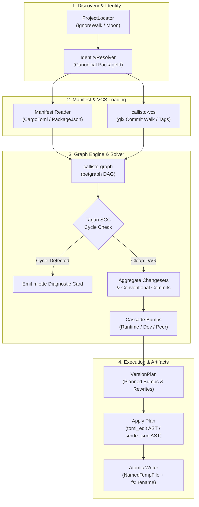
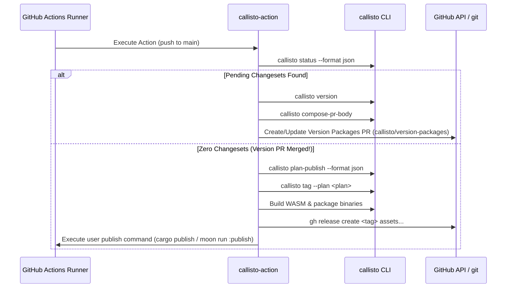

# Callisto Architecture & Engineering Guide

Callisto is a polyglot monorepo versioning, changeset cascading, and release management engine for Rust (`Cargo`), JavaScript/TypeScript (`npm`, `pnpm`, `yarn`), Python (`pyproject.toml`), Go (`go.mod`), Deno (`deno.json`), and Moon (`moon`).

This document details the internal crate boundaries, trait seams, graph mechanics, file mutation guarantees, and execution pipelines.

---

## System Overview & Data Flow Pipeline

Callisto operates as a multi-stage pipeline: project discovery, manifest AST loading, dependency DAG construction, bump aggregation/cascade, and atomic disk persistence.



---

## Workspace Crate Map & Licensing Boundaries

Callisto is structured into 10 workspace crates divided across permissive (MIT/Apache-2.0) and copyleft (AGPL-3.0) licenses:

| Crate | License | Layer | Description | Key Tech / Seams |
| :--- | :--- | :--- | :--- | :--- |
| [`callisto-model`](crates/callisto-model) | MIT/Apache-2.0 | Layer 1 | Domain types, version grammars, JSON report schemas | `semver`, `schemars`, `serde` |
| [`callisto-format`](crates/callisto-format) | MIT/Apache-2.0 | Layer 1 | Byte-compatible changeset `.md` and `pre.json` parsers | `indexmap`, frontmatter parser |
| [`callisto-conventional`](crates/callisto-conventional) | AGPL-3.0 | Layer 1 | Conventional commit parser & severity classifier | `conventional_commits_next` |
| [`callisto-changelog`](crates/callisto-changelog) | AGPL-3.0 | Layer 1 | Sectioned Markdown changelog generator | `pulldown-cmark` |
| [`callisto-manifests`](crates/callisto-manifests) | AGPL-3.0 | Layer 2 | Format-preserving manifest AST editors & atomic write | `toml_edit`, `serde_json`, `tempfile` |
| [`callisto-vcs`](crates/callisto-vcs) | AGPL-3.0 | Layer 2 | Native in-process Git engine & ref resolver | `gix` (gitoxide, target-gated for wasm32) |
| [`callisto-graph`](crates/callisto-graph) | AGPL-3.0 | Layer 3 | Dependency DAG solver & Tarjan SCC cycle diagnostics | `petgraph`, `IgnoreWalkLocator` |
| [`callisto-cli`](crates/callisto-cli) | AGPL-3.0 | Layer 4 | CLI binary, colored diff previews, diagnostic cards | `clap`, `miette`, `anstream`, `similar` |
| [`callisto-moon`](crates/callisto-moon) | AGPL-3.0 | Layer 4 | Moon extension host glue & WASM plugin target | `extism-pdk` (`wasm32-wasip1`) |
| [`callisto-fixtures`](crates/callisto-fixtures) | AGPL-3.0 | Dev | Multi-ecosystem corpus & in-memory test doubles | Dev-only test helpers |

### Dual Licensing Architecture

- **Permissive Data Tier (`callisto-model`, `callisto-format`)**:
  Contains domain contracts, version structs, JSON schema envelopes, and changeset `.md` parsers. IDE extensions, CI scripts, or third-party tools can import this tier under MIT/Apache-2.0 without bringing in copyleft dependencies.
- **Copyleft Execution Tier (`callisto-graph`, `callisto-cli`, `callisto-moon`, etc.)**:
  Contains graph mechanics, topological sorting algorithms, AST editors, Git engines, and CLI/Moon host glue under AGPL-3.0.

---

## Core Trait Seams

Callisto decouples execution logic from host environments using four trait seams defined in `callisto-model` and `callisto-graph`:

```rust
// 1. Locate projects across different workspace engines (FS ignore walk vs Moon CLI query)
pub trait ProjectLocator {
    fn projects(&self) -> Result<Vec<ProjectRoot>, LocateError>;
}

// 2. Resolve dependency edges and packages in the graph
pub trait DependencyResolver {
    fn packages(&self) -> impl Iterator<Item = &Package>;
    fn dependencies_of(&self, id: &PackageId) -> impl Iterator<Item = &DepEdge>;
}

// 3. Shell execution abstraction for running Git or external tools
pub trait CommandRunner: Send + Sync {
    fn exec(&self, cmd: &str, args: &[&str], cwd: &Path) -> Result<CommandOutput, CommandError>;
}

// 4. Per-ecosystem manifest reader/writer (Cargo.toml, package.json, etc.)
pub trait Manifest {
    fn current_version(&self) -> Result<Version, ManifestError>;
    fn write_version(&mut self, new_version: &Version) -> Result<(), ManifestError>;
    fn write_dependency(&mut self, name: &str, new_spec: DepSpec) -> Result<(), ManifestError>;
}
```

This design allows `callisto-cli` (standalone binary) and `callisto-moon` (WASM plugin inside Moon) to share 100% of the graph resolution engine while swapping shell execution and project discovery mechanisms.

---

## Dependency Graph Engine & Cascade Mechanics

Workspace package dependencies form a directed graph `petgraph::graph::DiGraph<PackageId, DepEdge>`.

### Topological Sorting & Cycle Detection

1. **Graph Construction**: Packages are registered as nodes; manifest dependency declarations (`dependencies`, `dev-dependencies`, `peerDependencies`) form directed edges.
2. **Tarjan's SCC Cycle Diagnostics**: Before executing topological sorting, `callisto-graph` runs Tarjan's Strongly Connected Components (SCC) algorithm. If circular dependencies exist (e.g. `pkg-a → pkg-b → pkg-a`), Callisto isolates the exact cycle path and formats a colorized `miette` diagnostic card:

   ```text
   Error: Circular dependency cycle detected in workspace graph
     pkg-a → pkg-b → pkg-a
   Tip: Refactor shared dependencies into a common crate or mark peer dependencies.
   ```

### Bump Cascade Propagation

When a package is bumped (e.g. `pkg-a` bumped from `1.0.0` to `1.1.0`), Callisto evaluates all reverse dependencies:

- **Runtime Dependencies**: Triggers a version bump on dependent packages (`pkg-b`) to maintain SemVer compatibility.
- **Range Rewriting**: Updates dependency version specs (`^1.0.0` → `^1.1.0` or `=1.1.0`) in dependent manifests.
- **Group Isolation**: Respects `[[fixed-group]]` and `[[linked-group]]` constraints in `callisto.toml` to lock synchronized package version bumps.

---

## AST Format Preservation & Atomic Disk Safety

Callisto never modifies manifests using regex or line-based string manipulation.

### Format Preservation

- **TOML (`Cargo.toml`)**: Uses `toml_edit` to parse manifest documents into concrete syntax trees (CST). Preserves inline comments, table ordering, trailing commas, and blank line spacing.
- **JSON (`package.json`)**: Uses `serde_json` with custom indentation fingerprinting to detect whether the file uses tabs or N spaces, preserving key ordering and indentation style.

### Atomic Disk Writes (`callisto-manifests::atomic`)

To prevent corrupted or half-written manifest files if a process is interrupted by a signal (`SIGINT`, `SIGTERM`) or CI timeout:

1. Writes updated manifest contents to a temporary file (`NamedTempFile`) created in the *same filesystem directory* as the target file.
2. Flushes buffers to disk.
3. Atomically replaces the target file via `fs::rename`.

---

## GitHub Actions Release Architecture (`callisto-action`)

Callisto provides a single, built-in composite action ([`.github/actions/callisto-action/action.yml`](.github/actions/callisto-action/action.yml)) that handles release orchestration:



---

## Verification & Engineering Invariants

All code contributed to Callisto must satisfy the following 4 engineering invariants:

1. **Safe Rust Only**: `unsafe_code = "forbid"` is enforced across all 10 workspace crates.
2. **Zero Clippy Warnings**: Code must compile cleanly with `cargo clippy --all-targets -- -D warnings`.
3. **Format Compliance**: Code must match standard `cargo fmt --check`.
4. **Complete Test Suite**: All unit, integration, doctests, and black-box E2E tests must pass (`cargo test --all-targets && cargo test --doc`).
