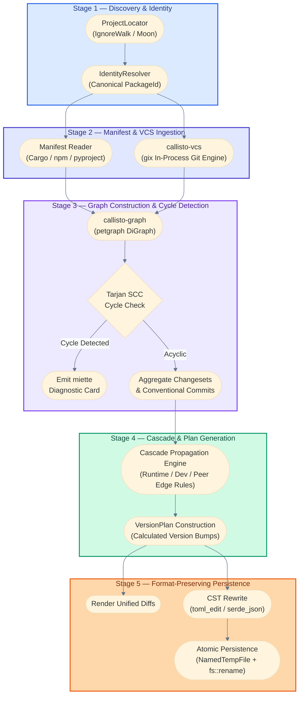
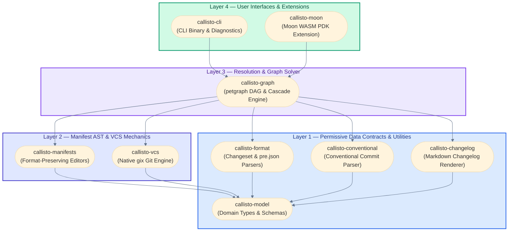
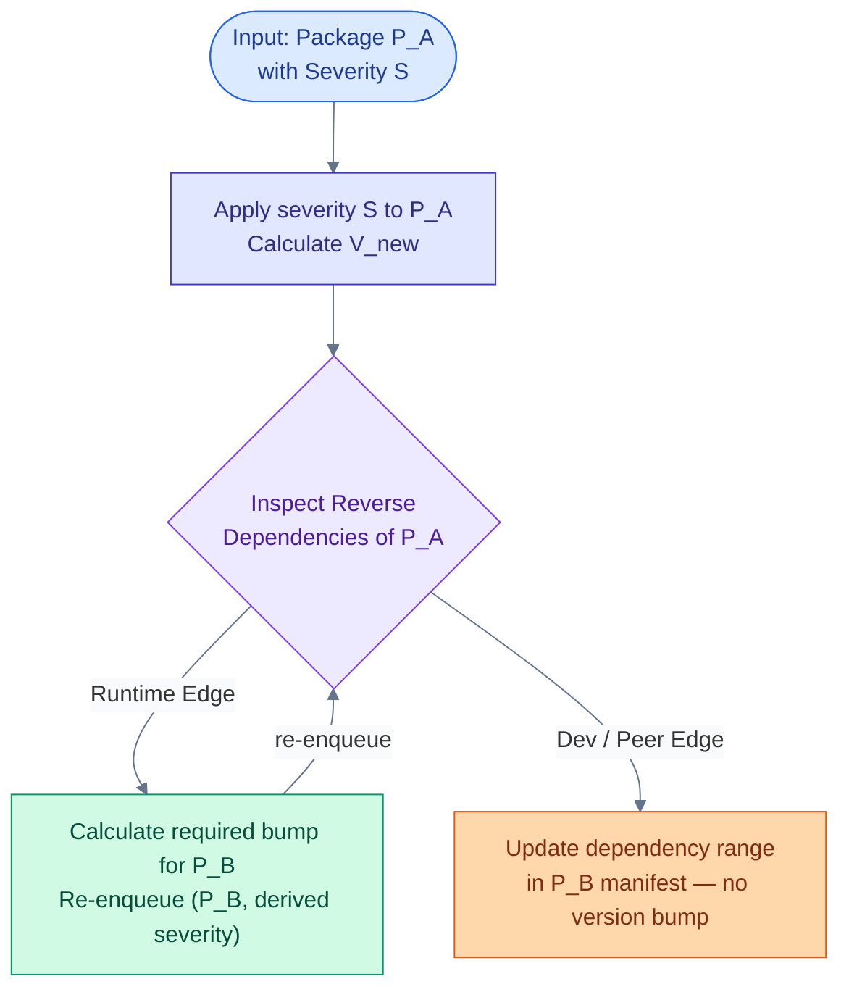
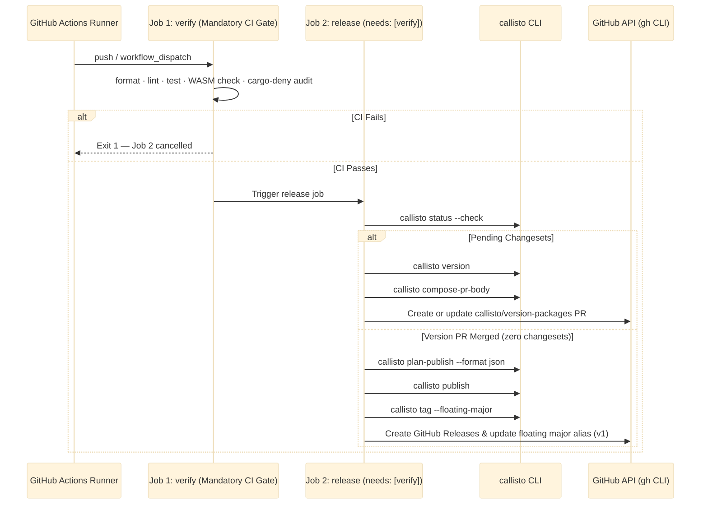

<p align="center">
  
</p>

<h1 align="center">Callisto Architecture & Engineering Specification</h1>

<p align="center">
  <b>Authoritative specification for crate topography, graph algorithms, format preservation, and CI orchestration.</b>
</p>

---

## 1. Executive Architecture & Strategic Invariants

Callisto addresses key architectural deficiencies in existing release management tools:
- **Runtime Performance**: Replaces heavy JavaScript/Node.js runtimes (`@changesets/cli`) with an optimized native Rust engine that completes status, versioning, and graph operations in `<10ms`.
- **AST Format Preservation**: Replaces destructive text/regex search-and-replace with concrete syntax tree (CST) editors (`toml_edit` and `serde_json` with indentation fingerprinting), preserving comments, table order, and whitespace.
- **Crash-Safe File Mutations**: Enforces atomic filesystem transactions using temporary directory file swaps (`NamedTempFile` + `fs::rename`) to prevent half-written or corrupt manifests during unexpected process termination.
- **In-Process Git Engine**: Eliminates external `git` subprocess spawns by leveraging `gix` (gitoxide) for fast, thread-safe repository discovery, commit traversal, and ref resolution.
- **Formal Graph Solver**: Constructs a directed acyclic graph (DAG) using `petgraph`, executing Tarjan's Strongly Connected Components (SCC) algorithm to detect circular dependencies before applying topological version cascades.
- **Dual Licensing Isolation**: Separates permissive data types (`MIT/Apache-2.0`) from copyleft execution logic (`AGPL-3.0`), allowing third-party tools to consume Callisto's domain contracts without importing AGPL code.

---

## 2. System Architecture & Pipeline Data Flow

Callisto processes monorepo release workflows through a deterministic 5-stage pipeline:



---

## 3. Workspace Crate Topography & Layer Isolation

Callisto is structured into 10 workspace crates organized across 4 strict layer boundaries to enforce acyclic dependencies:



### Layer Rules & Licensing Matrix

| Crate | License | Layer | Responsibility | Key Dependencies |
| :--- | :--- | :--- | :--- | :--- |
| `callisto-model` | MIT/Apache-2.0 | Layer 1 | Core domain primitives, version grammars, JSON report schemas, atomic disk writes | `semver`, `schemars`, `serde`, `tempfile` |
| `callisto-format` | MIT/Apache-2.0 | Layer 1 | Byte-compatible parser and writer for changeset `.md` and `pre.json` | `indexmap`, `serde` |
| `callisto-conventional` | AGPL-3.0 | Layer 1 | Conventional commit parsing and severity classification | `conventional_commits_next` |
| `callisto-changelog` | AGPL-3.0 | Layer 1 | Sectioned Markdown changelog rendering | `pulldown-cmark` |
| `callisto-manifests` | AGPL-3.0 | Layer 2 | Format-preserving manifest AST editing | `toml_edit`, `serde_json` |
| `callisto-vcs` | AGPL-3.0 | Layer 2 | Native in-process Git discovery, commit walks, and tag listing | `gix` (gitoxide, target-gated for wasm32) |
| `callisto-graph` | AGPL-3.0 | Layer 3 | Dependency DAG construction, Tarjan SCC cycle detection, cascade engine | `petgraph`, `ignore` |
| `callisto-cli` | AGPL-3.0 | Layer 4 | Standalone CLI binary, colored diff previews, `miette` error reporting | `clap`, `miette`, `anstream`, `similar` |
| `callisto-moon` | AGPL-3.0 | Layer 4 | Moon extension host integration and WASM compilation target | `extism-pdk` (`wasm32-wasip1`) |
| `callisto-fixtures` | AGPL-3.0 | Dev | Multi-ecosystem corpus and in-memory test doubles | Dev-only test helpers |

---

## 4. Formal Domain Model & Type System

Callisto defines type-safe primitives in `callisto-model` to prevent stringly-typed bugs across ecosystem boundaries:

### Core Domain Primitives

- `PackageId(String)`: Unique canonical identity for a workspace package (e.g. `callisto-cli` or `@myorg/web-app`).
- `Version`: SemVer version wrapper (`semver::Version`) enforcing SemVer 2.0.0 specification rules.
- `Severity`: Bumping magnitude enum (`None < Patch < Minor < Major`). Implements `Ord` to allow computing maximum required severity across multiple changesets.
- `Changeset`: Representation of a `.changeset/<id>.md` document:
  ```rust
  pub struct Changeset {
      pub id: String,
      pub releases: IndexMap<PackageId, Severity>,
      pub summary: String,
  }
  ```
- `PreState`: Model for `.changeset/pre.json` managing pre-release modes (e.g. `alpha`, `beta`, `rc`):
  ```rust
  pub struct PreState {
      pub mode: PreMode, // Enter | Exit
      pub tag: String,
      pub initial_versions: IndexMap<PackageId, Version>,
      pub changesets: Vec<String>,
  }
  ```

---

## 5. Manifest Parsing & Atomic Mutation Mechanics

Callisto guarantees that editing package manifests (`Cargo.toml`, `package.json`) never corrupts file formatting or damages unmanaged sections.

### Concrete Syntax Tree (CST) Editing for `Cargo.toml`

`callisto-manifests` uses `toml_edit` to parse `Cargo.toml` into a Concrete Syntax Tree. This ensures:
- Header comments, inline comments, and section spacing are preserved exactly.
- Key ordering within tables remains untouched.
- Version string updates target only the specific `[package].version` item or path dependency tables (`[dependencies.crate-name].version`).

### Indentation Fingerprinting for `package.json`

JSON specifications do not preserve formatting. `callisto-manifests` addresses this by fingerprinting `package.json` before parsing:
1. Scans line prefixes to determine indentation style (`IndentStyle::Tabs` vs `IndentStyle::Spaces(usize)`).
2. Parses the document using `serde_json` with `preserve_order` enabled to preserve key insertion order.
3. Serializes updated documents using a custom formatter matching the fingerprinted indentation style and line endings (`LF` vs `CRLF`).

### Atomic Disk Persistence (`atomic_write`)

To guarantee crash-safety during file writes:

```rust
pub fn atomic_write(target_path: &Path, content: &[u8]) -> Result<(), ManifestError> {
    let parent_dir = target_path.parent().ok_or(...)?;
    let mut temp_file = NamedTempFile::new_in(parent_dir)?;
    temp_file.write_all(content)?;
    temp_file.flush()?;
    temp_file.persist(target_path)?;
    Ok(())
}
```

By creating `NamedTempFile` in the same directory as the target file, Callisto ensures the final `fs::rename` step is an atomic OS kernel operation on POSIX and Windows filesystems.

---

## 6. Dependency DAG Engine & Algorithmic Complexities

Workspace package relationships form a directed graph `G = (V, E)` where vertices $V$ represent `PackageId` nodes and edges $E$ represent dependency declarations.

### Topological Sorting & Cycle Diagnostics

1. **Graph Construction**: `callisto-graph` builds a `petgraph::graph::DiGraph<PackageId, DepEdge>`.
2. **Cycle Detection (Tarjan's SCC Algorithm)**:
   - Before calculating version bumps, `callisto-graph` executes Tarjan's Strongly Connected Components algorithm ($O(|V| + |E|)$ time, $O(|V|)$ space).
   - If circular dependencies exist (e.g. $A \to B \to C \to A$), Callisto isolates the exact cycle path and formats a colorized `miette` diagnostic card:

   ```text
   Error: Circular dependency cycle detected in workspace graph
     callisto-graph → callisto-manifests → callisto-graph
   Tip: Refactor shared types into a common Layer 1 crate or mark peer dependencies.
   ```

3. **Topological Order Execution**:
   - Executes Kahn's algorithm ($O(|V| + |E|)$) to establish linear build and publish ordering.

### Bump Cascade Engine

When a package $P_A$ is bumped from version $V_{old}$ to $V_{new}$ with severity $S$:



### Version Groups (Fixed & Linked)

`callisto.toml` supports version group rules:
- **`[[fixed-group]]`**: All packages in the group are forced to bump in lock-step to the maximum version calculated across any member in the group.
- **`[[linked-group]]`**: Packages in the group share severity bumps, but maintain independent base version offsets.

---

## 7. In-Process VCS Engine (`callisto-vcs`)

`callisto-vcs` integrates `gix` (gitoxide) for in-process Git operations, avoiding the performance overhead and flakiness of invoking `git` CLI subprocesses.

### Key VCS Capabilities

- **Repository Discovery**: Walks parent directories from the current working directory to locate `.git`.
- **Commit Walks**: Performs in-process commit history traversals to evaluate conventional commits since a given Git ref or release tag.
- **Tag Listing**: Matches tags against glob patterns (`v*`, `@scope/*`) using `globset`.

### Target-Gated WASM Compatibility Architecture

`gix` relies on POSIX signal handlers (`gix-tempfile` -> `signal-hook-registry`), which are unsupported when compiling to WebAssembly (`wasm32-wasip1`). `callisto-vcs` uses conditional compilation target-gating:

```rust
// Native CLI target (macOS, Linux, Windows)
#[cfg(not(target_arch = "wasm32"))]
pub struct GitRepository {
    repo: gix::Repository,
}

// WASM extension target (wasm32-wasip1 for Moon)
#[cfg(target_arch = "wasm32")]
pub struct GitRepository;
```

On WASM targets, native Git operations cleanly return non-fatal fallback errors while project discovery and graph operations execute at full speed.

---

## 8. Extension Architecture & Trait Seams

Callisto decouples core algorithms from platform-specific I/O using four core trait seams:

```rust
// 1. Locate workspace project roots
pub trait ProjectLocator {
    fn projects(&self) -> Result<Vec<ProjectRoot>, LocateError>;
}

// 2. Supply graph node and edge metadata
pub trait DependencyResolver {
    fn packages(&self) -> impl Iterator<Item = &Package>;
    fn dependencies_of(&self, id: &PackageId) -> impl Iterator<Item = &DepEdge>;
}

// 3. Command execution abstraction
pub trait CommandRunner: Send + Sync {
    fn exec(&self, cmd: &str, args: &[&str], cwd: &Path) -> Result<CommandOutput, CommandError>;
}

// 4. Per-ecosystem manifest reader/writer
pub trait Manifest {
    fn current_version(&self) -> Result<Version, ManifestError>;
    fn write_version(&mut self, new_version: &Version) -> Result<(), ManifestError>;
    fn write_dependency(&mut self, name: &str, new_spec: DepSpec) -> Result<(), ManifestError>;
}
```

### Moon WASM Plugin Binding (`callisto-moon`)

`callisto-moon` compiles Callisto into a `wasm32-wasip1` plugin using `extism-pdk`. Moon loads `callisto-moon.wasm` inside Extism, passing host environment queries through Extism FFI exports (`#[plugin_fn]`).

---

## 9. GitHub Actions Orchestration (`callisto-action`)

Callisto includes a built-in composite action ([`.github/actions/callisto-action/action.yml`](.github/actions/callisto-action/action.yml)) for CI/CD automation and supports 3 release paradigms (see [`docs/release-paradigms.md`](docs/release-paradigms.md)):



### Complete Action Input Matrix

| Input | Default | Purpose |
| :--- | :--- | :--- |
| `publish` | `""` | Command to execute when publishing packages (`cargo publish`, `pnpm publish`, `moon run :publish`). |
| `version_command` | `"callisto version"` | Custom versioning command. |
| `commit_message` | `"chore: version packages"` | Commit message for the Version Packages PR. |
| `title` | `"chore: version packages"` | Pull Request title. |
| `pr_label` | `"callisto: release"` | Label automatically attached to the Version Packages PR. |
| `create_github_release` | `"true"` | Toggle GitHub Release entry creation for calculated tags. |
| `setup_git_user` | `"true"` | Automatically configure `git config user.name` & `user.email` bot credentials. |
| `branch` | `"main"` | Base branch for Version PRs. |
| `cwd` | `"."` | Working directory path if workspace root is nested in a subfolder. |

### Diagnostic Problem Matchers & Toolchain Isolation

- **Inline PR Annotations**: Registered [`.github/callisto-problem-matcher.json`](.github/callisto-problem-matcher.json) in `setup-callisto`. Automatically highlights invalid `.changeset/*.md` syntax or missing package IDs as inline callouts on PR diff lines.
- **Pre-installed Toolchain Targets**: All toolchain setup steps declare `targets: wasm32-wasip1` up-front alongside `rustfmt` and `clippy`. This prevents parallel `rustup` download race conditions when Moon executes 10 crate tasks in parallel.
- **Unbuffered Stream Output & UI Accordions**: Long-running shell commands use `::group::` and `::endgroup::` annotations for foldable UI accordions, streaming stdout and stderr live to the runner console.

---

## 10. PR Pre-Flight Verification & Local Git Hooks

### PR Pre-Flight Verification (`callisto-validate`)

Every Pull Request runs the standalone [`.github/actions/callisto-validate/action.yml`](.github/actions/callisto-validate/action.yml) action:
1. **Package Discovery Guard**: Verifies all workspace crates and packages are accounted for in `callisto.toml`.
2. **Schema & Config Health**: Validates `callisto.toml` fields and types.
3. **Changeset Syntax Integrity**: Verifies `.changeset/*.md` frontmatter and package IDs.
4. **Pre-Flight Release Simulation**: Simulates `callisto plan-publish` topological DAG sorting to ensure zero cyclic dependencies before PR merge.

### Ultra-Fast Local Git Hooks (`pre-commit` & `pre-push`)

Callisto standardizes local developer hook workflows in [`justfile`](justfile):
- `just pre-commit` (~100ms): Fast formatting check before local commits.
- `just pre-push` (~1.5s): Formatting check and Clippy lints before remote pushes.
- `just hooks`: Installs native `.git/hooks/pre-commit` and `.git/hooks/pre-push` shell scripts in one command.

---

## 11. Engineering Invariants & Quality Controls

All contributions to Callisto must adhere to the following 4 engineering invariants:

1. **Safe Rust Strictness**: `unsafe_code = "forbid"` is enforced across all 10 workspace crates.
2. **Zero Clippy Warnings**: Code must compile with zero warnings under `cargo clippy --all-targets -- -D warnings`.
3. **Format Enforcement**: Code formatting must strictly match `cargo fmt --check`.
4. **Comprehensive Test Suite Coverage**: Unit, integration, doctests, and lifecycle E2E tests must pass (`just ci`).

---

## 12. Zero-Config Multi-Platform Native Matrix Auto-Discovery (`callisto matrix`)

To eliminate configuration duplication and configuration drift across native Rust, NAPI-RS, Maturin (Python), and Java (JNI) polyglot monorepos, Callisto provides dynamic matrix auto-discovery:

```text
┌────────────────────────────────────────────────────────────────────────┐
│               CALLISTO NATIVE MATRIX AUTO-DISCOVERY                     │
├────────────────────────────────────────────────────────────────────────┤
│ Workspace Manifests (Cargo.toml, package.json, pyproject.toml)        │
│ ↳ Single Source of Truth: napi.triplets, maturin.targets, engines      │
├────────────────────────────────────────────────────────────────────────┤
│ callisto matrix --format json                                          │
│ ↳ Dynamically computes runner OS, target triples, & runtime versions   │
├────────────────────────────────────────────────────────────────────────┤
│ GitHub Actions / GitLab CI Job Matrix                                  │
│ ↳ Parallel native build matrix execution without hardcoded YAML arrays  │
└────────────────────────────────────────────────────────────────────────┘
```

### Manifest-Driven Target Auto-Detection

1. **NAPI-RS (`package.json`)**: Auto-detects `napi.triplets` (e.g. `x86_64-unknown-linux-gnu`, `aarch64-apple-darwin`, `x86_64-pc-windows-msvc`) and maps them to GitHub Actions runner OS (`ubuntu-latest`, `macos-14`, `windows-latest`).
2. **Maturin (`pyproject.toml`)**: Auto-detects `tool.maturin.targets` and Python runtime compatibility bounds.
3. **Runtime Engine Compatibility**: Automatically extracts Node.js (`engines.node`) and Java (`java.version` / `pom.xml`) versions directly from package manifests, eliminating duplicate version strings in CI YAML.

### Zero-Config GitHub Actions Workflow Pattern

```yaml
jobs:
  matrix:
    runs-on: ubuntu-latest
    outputs:
      matrix: ${{ steps.discover.outputs.matrix }}
    steps:
      - uses: actions/checkout@v4
      - uses: ./.github/actions/setup-callisto
      - id: discover
        run: echo "matrix=$(callisto matrix --format json)" >> $GITHUB_OUTPUT

  build:
    needs: matrix
    strategy:
      matrix: ${{ fromJSON(needs.matrix.outputs.matrix) }}
    runs-on: ${{ matrix.os }}
    steps:
      - uses: actions/checkout@v4
      - uses: ./.github/actions/setup-callisto
      - run: callisto publish-target --package ${{ matrix.package }} --target ${{ matrix.target }}
```

---

## 13. Hermetic Build Systems & Custom Orchestration (Bazel, Buck2, Nix, GitLab CI)

Callisto's core engine is decoupled from GitHub Actions. All versioning, status calculation, dependency graph sorting, and matrix auto-discovery execute as pure, hermetic CLI subcommands that operate on filesystem inputs and emit standard JSON/Text data streams.

```text
┌────────────────────────────────────────────────────────────────────────┐
│             HERMETIC & ENGINE-AGNOSTIC CALLISTO ARCHITECTURE           │
├────────────────────────────────────────────────────────────────────────┤
│ Callisto Engine (crates/callisto-cli & callisto-graph)                 │
│ ↳ Pure Rust, Hermetic Input Ingestion, Zero GitHub API Hardcoding       │
├───────────────────────────────────┬────────────────────────────────────┤
│ CLI / BUILD SYSTEM INTERFACE      │ OUTPUT FORMAT                      │
├───────────────────────────────────┼────────────────────────────────────┤
│ callisto plan-publish             │ Hermetic JSON / Protobuf           │
│ callisto matrix                   │ Standard JSON array for any runner │
│ callisto status                   │ Struct/JSON workspace state        │
│ callisto tag                      │ Native Git refs or build outputs   │
└───────────────────────────────────┴────────────────────────────────────┘
```

### Bazel Integration Pattern (`rules_callisto`)

In Bazel (`BUILD.bazel`), Callisto operates as a hermetic toolchain binary:

```starlark
load("@rules_callisto//callisto:defs.bzl", "callisto_release_plan", "callisto_version_check")

# Hermetic changeset validation rule in Bazel build graph
callisto_version_check(
    name = "changeset_validation_test",
    srcs = glob([".changeset/*.md", "**/Cargo.toml", "**/package.json"]),
)

# Output target producing topological release plan for downstream Bazel actions
callisto_release_plan(
    name = "release_plan",
    srcs = glob(["**/*"]),
    out = "release_plan.json",
)
```

### Guarantees for Non-GitHub Environments

1. **Zero Network / API Lock-in**: `callisto status`, `callisto plan-publish`, and `callisto matrix` operate entirely on local workspace files and write to stdout/JSON. They run identically inside Bazel sandboxes, Nix flakes, GitLab CI, Buildkite, and Jenkins.
2. **Hermetic File Inputs**: Accepts explicit `--cwd` and `--config` overrides to run inside isolated build tool sandboxes without relying on global environment variables.
3. **Thin Adapter Seams**: GitHub Actions ([`callisto-action`](.github/actions/callisto-action/action.yml)), Moon WASM ([`callisto-moon`](crates/callisto-moon)), and Bazel (`rules_callisto`) are thin adapter layers wrapping the same core Rust CLI engine.

---

## 8. Multi-Phase Polyglot Master Specification & Architecture Roadmap

Callisto is engineered to support polyglot monorepos across **Rust, TypeScript/JS, Python, Go, Java (Maven/Gradle), and C# (.NET)** through a unified, 4-phase architectural roadmap.

```text
┌────────────────────────────────────────────────────────────────────────┐
│               CALLISTO MULTI-PHASE POLYGLOT ARCHITECTURE ROADMAP       │
├─────────┬─────────────────┬───────────────────┬────────────────────────┤
│ PHASE   │ ECOSYSTEM       │ MANIFEST & FORMAT │ VERSION DRIVER & SPEC  │
├─────────┼─────────────────┼───────────────────┼────────────────────────┤
│ Phase 1 │ Python          │ pyproject.toml    │ ManifestField          │
│         │ (Implemented)   │ (toml_edit CST)   │ PEP 440 (pep440_rs)    │
├─────────┼─────────────────┼───────────────────┼────────────────────────┤
│ Phase 2 │ Go              │ go.mod / go.work  │ GitTag                 │
│         │ (Specified)     │ (modfile AST)     │ SemVer 2.0.0 (vX.Y.Z)  │
├─────────┼─────────────────┼───────────────────┼────────────────────────┤
│ Phase 3 │ Java            │ pom.xml / gradle  │ ManifestField / Prop   │
│         │ (Specified)     │ (xmltree CST)     │ Maven (Qualifiers)     │
├─────────┼─────────────────┼───────────────────┼────────────────────────┤
│ Phase 4 │ C# / .NET       │ *.csproj / CPM    │ ManifestField          │
│         │ (Specified)     │ (xmltree CST)     │ NuGet SemVer           │
└─────────┴─────────────────┴───────────────────┴────────────────────────┘
```

### Ecosystem Implementation Status Legend

- **`[LIVE: IMPLEMENTED]`**: Fully compiled, tested, and active in the Rust workspace today.
- **`[PLANNED: SPECIFIED]`**: Architecturally specified in `docs/` and ready for implementation in future phases.

### Phase 1: Python Engine (`pyproject.toml` / PyPI) — **STATUS: [LIVE: IMPLEMENTED]**
- **CST Engine**: `PyprojectToml` in `callisto-manifests` powered by `toml_edit::DocumentMut`.
- **Packaging Standards**: PEP 621 (`[project]`), Poetry (`[tool.poetry]`), Flit (`[tool.flit.metadata]`), Hatch, and Maturin.
- **Grammar & Requirements**: PEP 440 versioning (`pep440_rs`) and PEP 508 dependency partitioning (extras `[...]`, environment markers `;`).
- **Lockfile Auto-Staging**: `uv.lock`, `poetry.lock`, `pdm.lock`, `Pipfile.lock`.

### Phase 2: Go Engine (`go.mod` / `go.work` / GoProxy) — **STATUS: [PLANNED: SPECIFIED]**
- **Architecture Shift**: **Tag-Driven Versioning** (`VersionSource::GitTag`).
- **Submodule Rules**: Go monorepos enforce directory-prefixed tags (`subpkg/vX.Y.Z`). Major `v2+` bumps update module path suffixes (`module github.com/user/repo/subpkg/v2`).
- **Lockfile Auto-Staging**: `go.sum`.

### Phase 3: Java Engine (Maven `pom.xml` & Gradle `build.gradle` / `gradle.properties`) — **STATUS: [PLANNED: SPECIFIED]**
- **CST Engine**: XML CST editor (`xmltree` / `quick-xml`) for `pom.xml` preserving XML comments and indentation. Properties parser for `gradle.properties`.
- **Version Grammar**: Maven Qualifier Versioning (`1.2.3-SNAPSHOT`, `1.2.3.Final`).
- **Lockfile Auto-Staging**: `gradle.lockfile`.

### Phase 4: C# / .NET Engine (`*.csproj` & `Directory.Packages.props`) — **STATUS: [PLANNED: SPECIFIED]**
- **CST Engine**: MSBuild XML CST editor (`xmltree`) for `*.csproj` and `Directory.Build.props`.
- **Central Package Management (CPM)**: Updating `<PackageVersion Include="..." Version="..." />` in `Directory.Packages.props`.
- **Lockfile Auto-Staging**: `packages.lock.json`.


