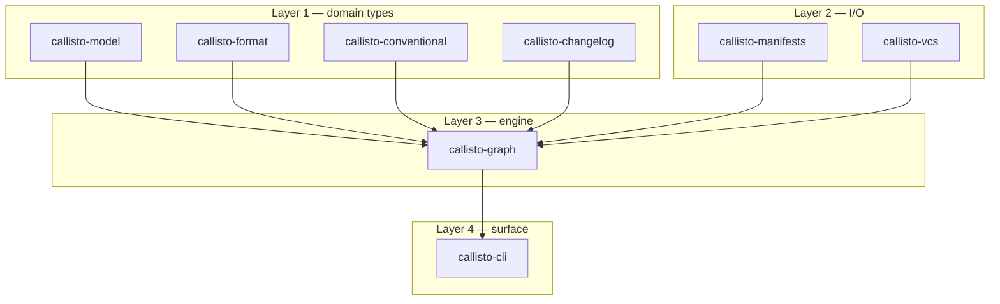

<p align="center">
  
</p>

<p align="center">
  <b>The fast, crash-safe, polyglot monorepo release engine.</b><br />
  <i>Replaces Node.js runtimes, fragile regular expression edits, and duplicate CI matrix YAML with a single native Rust binary.</i>
</p>

<p align="center">
  <a href="https://github.com/orin-dx/callisto/actions/workflows/callisto-ci.yml"></a>
  <a href="LICENSE"></a>
  <a href="crates/callisto-model"></a>
</p>

---

## Key Capabilities

> **Native Speed**  
> A native Rust binary — no Node.js runtime startup cost — for workspace discovery and version planning.

> **Concrete Syntax Tree (CST) Format Preservation**  
> Edits `Cargo.toml` and `package.json` using `toml_edit` and `serde_json` indentation fingerprinting, preserving user comments, table ordering, and whitespace.

> **Crash-Safe Atomic Disk Writes**  
> Writes updates to `NamedTempFile` temporary buffers before atomic POSIX `fs::rename` swaps, preventing corrupt or partial manifest writes during process interruption.

> **Topological Directed Graph Solver**  
> Models workspace package dependencies using `petgraph`'s Kahn topological solver and Tarjan's SCC algorithm to compute cascading version bumps and catch circular dependency cycles.

> **Zero-Config Native Matrix Auto-Discovery**  
> `callisto matrix` auto-discovers napi-rs and maturin build targets (`napi.targets`, `[tool.maturin].targets`) plus npm/PyPI runtime constraints (`engines.node`, `requires-python`) straight from manifests — no duplicate CI YAML to keep in sync.  
> Java (`java.version`) and .NET native-AOT discovery are planned for a future release.

> **Native napi/maturin Platform-Package Coordination**  
> One native crate compiling to N architecture-specific npm/PyPI packages plus one wrapper package that depends on all of them is a first-class case, not a workaround: callisto gates the wrapper's publish on every platform sibling actually succeeding, so `optionalDependencies` never point at a version that was never uploaded. No other changesets-family tool models this shape at all.

> **Hermetic & Build-System Agnostic**  
> Pure Rust CLI engine runs seamlessly in Bazel sandboxes (`rules_callisto`), Buck2, Nix flakes, moon (via proto), GitHub Actions, GitLab CI, and local VCS hooks (`just hooks`).

---

## Quick Start (4 Steps)

```text
$ callisto status
Status (schema v1):
  callisto-cli 0.1.0 (pending: minor)
  callisto-graph 0.1.0 (pending: patch)

$ callisto version
Version Plan (schema v1):
  callisto-cli 0.1.0 → 0.2.0
  callisto-graph 0.1.0 → 0.1.1
```

### Step 1: Initialize Callisto in Your Workspace

Run `init` in your repository root to create `callisto.toml` and `.changeset/`:

```bash
callisto init --yes
```

### Step 2: Create a Changeset

When adding a feature, fix, or breaking change to a package:

```bash
callisto add --package my-crate:minor --summary "Add authentication middleware"
```

This generates a `.changeset/<random-id>.md` file in your repository.

### Step 3: Inspect Workspace Status

View pending changesets and calculated version bumps across your monorepo DAG:

```bash
callisto status
```

### Step 4: Preview & Apply Version Bumps

Preview calculated manifest modifications with unified colored diffs:

```bash
# Preview diffs without modifying files
callisto version --dry-run

# Apply version bumps, update changelogs, and consume changesets
callisto version
```

> [!TIP]
> Run `callisto version --dry-run` locally anytime to inspect calculated version bumps and changelog updates with colored diffs before committing.

---

## Publishing Packages

`callisto version` bumps and commits. `callisto release` then publishes every package whose current version has no tag yet: registry publish, git tag, and GitHub release for each. It runs on any branch from a clean worktree and writes a receipt only with `--receipt <file>`:

```bash
# Preview exactly what would be released (read-only, works anywhere)
callisto release --dry-run

# Publish, tag, and create GitHub releases for every unreleased package
callisto release

# Restrict to named packages
callisto release --package cargo/my-crate --package npm/my-lib
```

When nothing is unreleased it prints `Nothing to release.` and exits 0. A workspace with `[[release.artifact]]` slots or napi/maturin platform packages releases from CI instead (`callisto release plan`, `release artifact-manifest`, `release execute`); `callisto release --dry-run` still previews it locally. See [`docs/06-publishing.md`](docs/06-publishing.md).

`callisto-action` (the bundled GitHub Action) now creates or updates only the version PR. The repository release workflow performs plan/build/attested execute after that PR merges; see [`docs/06-publishing.md`](docs/06-publishing.md).

---

## Release Workflow & Branch Configuration

Callisto integrates natively with GitHub Actions, GitLab CI, and custom release pipelines.

### 1. Release PR Branch Naming & Configuration

When Callisto generates automated release pull requests, it targets the default release branch **`changeset-release/main`** (matching `@changesets/action` standards).

You can override the release branch name per invocation using the `--branch` flag:

```bash
# Generate PR body targeting a custom release branch
callisto compose-pr-body --branch release-packages
```

### 2. Production GitHub Actions Workflow (`release.yml`)

Create `.github/workflows/release.yml` to automate version bumps and the release PR on `push` to `main`:

```yaml
name: Release

on:
  push:
    branches: [main]

concurrency:
  group: ${{ github.workflow }}-${{ github.ref }}
  cancel-in-progress: true

jobs:
  release:
    name: Release / Version Packages
    runs-on: ubuntu-latest
    permissions:
      contents: write
      pull-requests: write
      id-token: write  # OIDC registry publishing

    steps:
      - name: Checkout Repository
        uses: actions/checkout@v4
        with:
          fetch-depth: 0

      - name: Install Rust Toolchain
        uses: dtolnay/rust-toolchain@stable

      - name: Run Callisto Release Action
        uses: orin-dx/callisto-action@v1
        with:
          branch: changeset-release/main
          # The release workflow performs publication after merge.
```

### 3. Bypassing Heavy CI Workflows on Release PRs

Release PRs contain automated version bumps and changelog updates. To prevent running expensive CI build matrices on release PRs, ignore `changeset-release/**` branches in your main `.github/workflows/ci.yml`:

```yaml
name: CI Pipeline

on:
  push:
    branches: [main]
  pull_request:
    branches-ignore:
      - 'changeset-release/**'
```

---

## Why Callisto?

Callisto combines ideas from `@changesets/cli`, `release-please`, and `nx release` into one native Rust engine built for polyglot monorepos:

| | Callisto | Alternatives |
| :--- | :--- | :--- |
| **Speed** | Native Rust binary — no runtime startup cost | `@changesets/cli`, `release-please`, `nx release` pay a Node.js startup cost |
| **Manifest edits** | CST-based (`toml_edit`, `serde_json`), preserves comments/order/whitespace | `release-please` uses regex; `@changesets/cli` re-serializes JSON with default formatting |
| **Cycle detection** | Kahn + Tarjan SCC with `miette` diagnostic cards | `release-please` is single-repo only; `nx release` is tied to Nx JS trees |
| **Matrix discovery** | Auto-discovers napi-rs/maturin targets and npm/PyPI runtime constraints from manifests (Java/.NET planned) | Manual 50-line matrix arrays in CI YAML |
| **Portability** | Runs in Bazel, Buck2, Nix, moon, GitHub Actions, GitLab CI, and local Git hooks | Locked to GitHub REST APIs or JS workspace tooling |

### Feature comparison

| Capability | Callisto | `@changesets/cli` | `release-please` | `knope` |
| :--- | :--- | :--- | :--- | :--- |
| Intent format | Changesets (byte-compatible) | Changesets | Conventional Commits | Changesets or commits |
| Cargo workspaces | Native | — | Plugin | Yes |
| npm workspaces | Yes | Yes | Yes | Yes |
| Cross-ecosystem cascade | Yes | — | Per-ecosystem | — |
| napi/maturin platform-package coordination | Native | — | — | — |
| GitHub Release binary assets | In implementation | — | Yes | — |

*Cross-ecosystem cascade*: a version bump propagates along real dependency edges — a Cargo crate bump cascades into the npm packages that depend on it, automatically. *Platform-package coordination* is the sharper case: one native crate compiling to N architecture-specific npm/PyPI packages plus one wrapper package depending on all of them — nothing else in this table treats that shape as a first-class case instead of a hand-rolled CI workaround.

---

## Installation

> [!IMPORTANT]
> Callisto enforces safe Rust (`#![forbid(unsafe_code)]`) and POSIX atomic disk writes (`NamedTempFile` + `fs::rename`) across all workspace manifest edits.

### 1. Standalone Native Binary (Cargo)

```bash
cargo install callisto-cli
```

### 2. Pre-Built Release Binary (GitHub Releases)

Download pre-compiled binaries for Linux (x86_64) or macOS from [GitHub Releases](https://github.com/orin-dx/callisto/releases):

```bash
curl -sL https://github.com/orin-dx/callisto/releases/latest/download/callisto-linux-amd64.tar.gz | tar -xz -C /usr/local/bin
```

### 3. proto

Callisto ships a [proto](https://moonrepo.dev/proto) plugin that installs the release binary for macOS (arm64) and Linux (x86_64, glibc or musl). Add it to `.prototools`:

```toml
callisto = "0.8.0"

[plugins.tools]
callisto = "https://raw.githubusercontent.com/orin-dx/callisto/main/proto/callisto.toml"
```

Then run `proto install`.

### Using callisto with moon

moon installs tools through proto, so the `.prototools` entry above makes `callisto` available to moon tasks. Example `.moon/tasks/callisto.yml`:

```yaml
tasks:
  callisto-check:
    command: "callisto status --check"
    options:
      cache: false
  callisto-version:
    command: "callisto version"
    options:
      cache: false
      runInCI: false
  callisto-release-preview:
    command: "callisto release --dry-run"
    options:
      cache: false
      runInCI: false
```

`callisto status --check` exits non-zero when the workspace has error diagnostics. The moon extension (`callisto-moon.wasm`) was removed in favor of this setup.

---

## Workspace Crate Architecture

Callisto is structured into 9 workspace crates divided between MIT-licensed foundations and FSL-licensed product code:



| Layer | Crate | License | Purpose |
| :--- | :--- | :--- | :--- |
| **Layer 1** | [`callisto-model`](crates/callisto-model) | MIT | Domain primitives, version grammars, JSON report contracts |
| | [`callisto-format`](crates/callisto-format) | MIT | Changeset `.md` and `pre.json` parsers and writers |
| | [`callisto-conventional`](crates/callisto-conventional) | FSL-1.1-MIT | Conventional commit parsing and bump severity classification |
| | [`callisto-changelog`](crates/callisto-changelog) | FSL-1.1-MIT | Markdown changelog renderer |
| **Layer 2** | [`callisto-manifests`](crates/callisto-manifests) | FSL-1.1-MIT | Format-preserving manifest AST editors and atomic file writes |
| | [`callisto-vcs`](crates/callisto-vcs) | MIT | Native in-process Git operations powered by `gix` (gitoxide) |
| **Layer 3** | [`callisto-graph`](crates/callisto-graph) | FSL-1.1-MIT | Dependency DAG solver and Tarjan SCC cycle diagnostics |
| **Layer 4** | [`callisto-cli`](crates/callisto-cli) | FSL-1.1-MIT | Standalone CLI binary, colored diff previews, `miette` diagnostic cards |
| **Dev** | [`callisto-fixtures`](crates/callisto-fixtures) | FSL-1.1-MIT | Multi-ecosystem corpus and in-memory test doubles |

---

## Development & Task Runners

Callisto uses `just` as its primary developer command runner, delegating workspace tasks to `moon`:

```bash
# Run full local CI suite (formatting, clippy lints, test suite, security audit)
just ci

# Run test suite
just test

# Check clippy lints
just lint

# Check code formatting compliance
just fmt-check

# Format code automatically
just fmt

# Check security advisories
just audit
```
